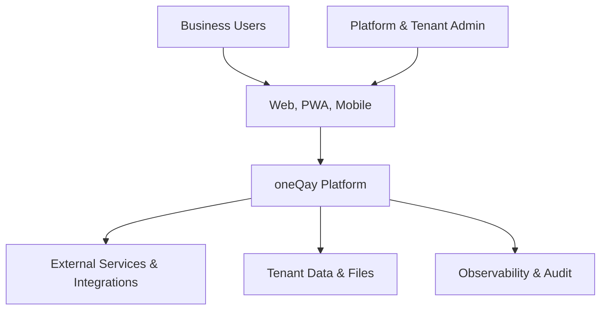
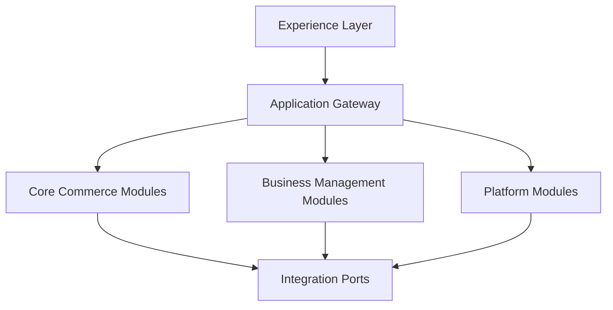
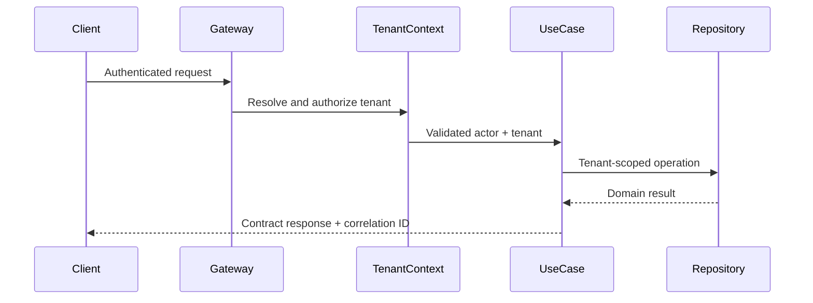

# oneQay Architecture

## Architecture goals

oneQay menggunakan **Modular Monolith First** dengan Clean Architecture dan Domain-Driven Design. Tujuannya adalah menyediakan sistem yang sederhana untuk dioperasikan pada tahap awal, namun memiliki boundary yang cukup kuat untuk berkembang tanpa menulis ulang business logic.

Enterprise Vision oneQay adalah **Enterprise Intelligent Business Management Platform** dan telah Approved melalui GOV-051. Enterprise Vision tidak mengubah implementation authority secara otomatis; bounded context, provider, physical schema, dan capability implementation tetap mengikuti keputusan dan authority masing-masing.

## Canonical product naming

Nama produk canonical adalah **oneQay**. Current/future-facing architecture text menggunakan `oneQay`; repository identifier `labzefry/oneQay`, immutable GitHub URLs, SHAs, historical commit messages, branch names, dan quoted historical evidence tidak ditulis ulang hanya untuk brand normalization.

## Context

## Enterprise Vision relationship

Architecture Direction adalah salah satu lapisan di bawah Enterprise Vision, bukan pengganti Product Vision atau Implementation Authority.

M6 memisahkan:

1. Product Vision;
2. Product Capability Map;
3. Product Architecture Direction;
4. Delivery Roadmap;
5. Implementation Authority.

Capability yang muncul pada `docs/handbook/ENTERPRISE_VISION.md` tidak otomatis menjadi module implementation atau Accepted bounded context.

## Logical layers

| Layer | Responsibility | Allowed dependency |
| --- | --- | --- |
| Domain | Entity, value object, invariant, domain service/event | Domain only |
| Application | Use case, orchestration, port, transaction boundary | Domain |
| Interface | HTTP, CLI, jobs, UI adapter, serialization | Application |
| Infrastructure | Database, cache, queue, storage, vendor integration | Application ports |

Dependency mengarah ke dalam. Domain dan application tidak boleh bergantung pada framework atau vendor.

## Modular topology

### Core commerce module candidates

- Organization, Outlet & Device
- Catalog & Pricing
- Inventory & Warehousing
- Sales & Point of Sale
- Purchasing & Supplier
- Customer & Loyalty

### Business management module candidates

- Finance & Accounting
- Reporting & Analytics
- Content Management

### Platform module candidates

- Tenant & Subscription
- Identity & Access Management
- Audit & Platform Operations
- Integration Hub
- Marketplace & Plugin Management
- AI Assistance

Daftar module candidate di atas tetap **Proposed** sampai domain discovery dan ADR/decision yang berlaku menyetujuinya. Enterprise Capability Map tidak mempromosikan daftar tersebut menjadi physical modules.

## Enterprise capability projection

Untuk menjaga hubungan dengan Enterprise Vision tanpa mengubah bounded-context status, architecture mengakui capability families berikut sebagai directional projection:

- **Core Business Platform:** Tenant & Organization, Identity & Access, Master Data, POS / Commerce, Inventory, Procurement, Finance / Accounting, CRM, HRM, Reporting & Business Intelligence.
- **Platform Capabilities:** Workflow, Notification, Audit, File / Document, Search, API, Integration, Webhook/Event Integration, Configuration, Localization, Observability, Recovery & Operational Control.
- **Extensibility:** Marketplace, Plugin / Extension, Public API, Partner Integration.
- **AI Platform:** AI Assistant, AI Insight, AI Automation, AI Recommendation, AI Analytics, AI Gateway / Policy Boundary.
- **Channels:** Web Application, PWA, Mobile / Android, Admin Platform, public/customer-facing surfaces, API/partner consumers.

These capability families are not physical module declarations and do not authorize implementation.

## Module contract

Setiap modul yang diotorisasi harus memiliki:

- bounded context dan ubiquitous language;
- public application interface;
- owned schema/table namespace;
- authorization policy;
- domain events;
- failure semantics;
- observability signals;
- test boundary;
- owner dan lifecycle status.

Modul tidak boleh membaca atau menulis tabel milik modul lain secara langsung. Interaksi sinkron melalui application contract; interaksi asinkron melalui event/outbox.

## Request flow

## Multi-tenant architecture

Tenant context terdiri dari immutable tenant ID, actor, roles/permissions, outlet scope, timezone, currency, locale, subscription entitlement, dan correlation ID.

Enforcement wajib terjadi pada:

- authentication dan tenant membership;
- authorization policy;
- repository/query boundary;
- cache key dan lock;
- queue/job payload;
- object storage path;
- search index;
- event envelope;
- audit log dan metrics dimension.

Cross-tenant operation hanya tersedia pada platform administration yang eksplisit, diaudit, menggunakan step-up authentication, dan memiliki purpose limitation.

M7.2 telah mempublikasikan bounded Tenant Kernel & Isolation Foundation untuk Local/Test/CI. M7.3 kemudian mempublikasikan bounded first-party identity dan organization/outlet/device context minimum dengan identity tetap terpisah dari tenant membership dan relationship authority tetap server-controlled. Publication facts tersebut tidak mengubah final persistence/schema authority.

## Data architecture

- **MySQL Server** adalah canonical relational database engine family melalui DEC-005.
- Default physical tenancy adalah shared database/shared schema dengan mandatory immutable tenant isolation key melalui DEC-005.
- Tenant authorization tetap Application-authoritative; database integrity/security adalah defense-in-depth.
- Transaksi tidak boleh melintasi boundary secara implisit.
- Outbox pattern disiapkan untuk reliable domain event publication.
- Cache bukan source of truth dan harus tenant-aware.
- File/object storage menggunakan generated identifier, content validation, malware scanning, dan signed access.
- Analytics workload dipisahkan saat beban membenarkan; OLTP tidak boleh menjadi reporting warehouse tanpa kontrol.

DEC-005 tidak memberi final business schema, executable SQL/migration, Production database, provider, atau database-configuration authority. M7.0–M7.4 juga tidak mengotorisasi physical schema coupling.

## API architecture

- REST API menggunakan versioned contract.
- Internal dan public API dipisahkan secara policy dan lifecycle.
- Error menggunakan stable code, correlation ID, dan safe message.
- Operasi finansial menggunakan idempotency key.
- Pagination wajib cursor-based untuk collection besar.
- Webhook ditandatangani, replay-protected, retryable, dan dapat diaudit.

Public API dan partner ecosystem tetap mengikuti capability/decision gate terpisah.

## Event-driven readiness

Domain event menggunakan envelope minimum: event ID, type, version, occurred at, tenant ID, actor/correlation/causation ID, dan payload. Event bersifat immutable. Consumer harus idempotent dan mendukung dead-letter/replay policy.

Event bus eksternal belum diwajibkan pada shared hosting. Implementasi awal dapat menggunakan transactional outbox dan worker terjadwal, selama application contract tetap sama.

## Integration architecture

Semua vendor ditempatkan di adapter melalui port. Adapter wajib memiliki timeout, bounded retry, circuit breaker bila tersedia, idempotency, rate limit awareness, audit, metric, dan failure mapping.

Provider atau vendor spesifik tidak menjadi keputusan Accepted hanya karena muncul dalam historical planning atau integration examples.

## Plugin architecture

Plugin system berstatus Deferred sampai trust model disetujui. Sebelum aktif, harus tersedia:

- signed manifest/package;
- compatibility dan capability declaration;
- tenant-scoped installation;
- permission grant dan revocation;
- resource quota;
- isolation/sandbox strategy;
- lifecycle, upgrade, rollback, dan kill switch;
- marketplace review serta audit.

Plugin tidak boleh memperoleh akses database langsung.

## AI architecture

AI capabilities wajib melalui controlled internal policy boundary yang menangani provider abstraction, data policy, redaction, tenant isolation, prompt/version registry, retrieval authorization, budget, rate limit, observability, human confirmation, evaluation, dan safe fallback sesuai capability yang diotorisasi.

AI tidak boleh menjadi source of truth untuk transaksi, otorisasi, accounting posting, inventory mutation, tenant-boundary decision, atau tindakan irreversible. Output berisiko tinggi memerlukan deterministic validation dan human approval.

No AI provider or AI automation implementation is authorized merely by Enterprise Vision or M7 progression.

## Deployment architecture

Business logic dan module contract harus identik pada seluruh stage:

1. Shared Hosting / cPanel
2. VPS
3. Dedicated Server
4. Docker
5. Cloud
6. Kubernetes

Perbedaan stage ditangani oleh configuration dan infrastructure adapter. Session, cache, file, job, dan scheduler harus dapat dieksternalisasi tanpa mengubah use case.

DEC-009 defines the capability-based Stage-1 Preview runtime requirements. P1 Shared Hosting/cPanel remains conditional/not selected; P2 Managed/Hardened VPS or Server remains the fallback execution class. Actual P2 target evidence is pending external input unless fresh evidence proves otherwise. Neither DEC-009 nor M7.0–M7.4 authorizes deployment execution or production release.

## Reliability

- Request memiliki timeout dan correlation ID.
- Retry hanya untuk kegagalan transient dan operasi idempotent.
- Long-running task dipindahkan ke background job.
- Health check dibagi menjadi liveness, readiness, dan dependency diagnostics sesuai kemampuan environment.
- Backup tidak dianggap valid sebelum restore test lulus.
- Recovery objective ditetapkan per capability sebelum production launch.

## Observability

Log terstruktur tidak boleh memuat secret atau payload sensitif. Metrics minimum mencakup request rate/error/duration, job status, database saturation, cache, external dependency, tenant isolation denial, authentication, dan business critical events. Distributed tracing diperkenalkan saat arsitektur mendukungnya.

## Security architecture

Gunakan deny-by-default authorization, least privilege, MFA untuk privileged roles, secure session, CSRF protection, input validation, output encoding, encryption in transit/at rest, secret rotation, audit log immutable, dependency scanning, dan threat modeling untuk flow kritis.

M7.1 application/configuration foundation, M7.2 tenant isolation foundation, dan M7.3 identity/organizational-context foundation harus dipertahankan oleh successor work. Identity tidak boleh disamakan dengan tenant membership; tenant membership dan organization/outlet/device relationship harus tetap server-controlled.

## Architecture fitness functions

- Domain layer bebas import infrastructure/framework.
- Tidak ada query data tenant tanpa enforced tenant scope.
- Tidak ada akses tabel lintas module tanpa keputusan arsitektur.
- Public contract memiliki version dan test.
- Semua migration yang diotorisasi harus terurut serta tervalidasi.
- Dependency cycle memblokir build.
- Secret scan dan high-severity security gate memblokir release.
- Capability map tidak boleh digunakan sebagai pengganti implementation authority.
- Current/future-facing brand reference harus menggunakan `oneQay`.
- Identity, tenant membership, and organizational authority remain separate server-controlled boundaries.

## Decision process

Keputusan signifikan dicatat di `docs/adr/ADR-NNN-title.md` dengan status Proposed, Accepted, Superseded, atau Rejected. ADR wajib untuk technology stack, tenancy model, auth, database, payment, event transport, plugin isolation, AI provider, dan perubahan deployment architecture.

## Current decision posture

Current canonical state reflects the separately governed decisions already published:

- ADR-001 through ADR-007: **Accepted** through DEC-002, DEC-003, DEC-005, DEC-006, DEC-007, DEC-008, and DEC-009 reconciliations respectively;
- ADR-008: **Accepted** representation of DEC-004;
- GD-007: Proposed;
- JRN-003 and JRN-013: Unresolved;
- final business schema and executable migrations: not authorized;
- provider-specific Production implementation: not authorized.

Open future architecture work includes plugin trust model, AI provider/data policy, final business schema details, target-specific runtime qualification, and other capability decisions only when their entry criteria and separate authority are available.

## Historical Technical Preview candidate architecture

The following profile is preserved as a **historical Proposed Technical Preview candidate recorded through Issue #23**. It must not override later Accepted decisions or the governed M7.0 Controlled Implementation Bridge.

- Delivery shape: Laravel/PHP modular monolith with domain/application boundaries independent of framework and infrastructure.
- Web client: Vue 3, Inertia, and Vite in one preview deployment unit.
- Historical data wording: MySQL-compatible shared schema with mandatory validated tenant identity and composite integrity strategy; DEC-005 later established canonical MySQL Server and shared database/shared schema direction.
- Historical identity wording: first-party revocable session, CSRF protection, and privileged-role TOTP baseline; DEC-006 later established the canonical auth/session direction.
- Payment: synthetic cash-only historical Preview boundary; DEC-007 later established cash-first + configurable manual/external recorded tender architecture while real provider processing remains outside current Preview authority.
- Connectivity: online-authoritative transactional mutation, consistent with DEC-008 first-MVP direction.
- Deployment: historical P1/P2 planning; DEC-009 later established capability-based Stage-1 Preview requirements with P1 conditional/not selected and P2 fallback execution class.
- Recovery: provisional RPO 24 hours and RTO 4 hours for synthetic sandbox data remain historical Technical Preview provenance, not Production commitments.
- SLO: zero cross-tenant exposure, 99% scheduled demo-window availability, and proposed p95 server response at or below 750 ms for the agreed preview load remain historical/proposed Preview provenance.

Architectural fitness for this preview requires two-tenant negative isolation tests, server-side deny-by-default authorization, exact money representation, idempotent retry boundaries, tenant-aware cache/job/file/audit behavior, deterministic migration/seeder rehearsal when separately authorized, secret isolation, versioned deployment, and backup/restore/rollback evidence before applicable runtime acceptance.

Historical Issue #23 text that described ADR-001 through ADR-007 as Proposed is preserved only as planning history. Current canonical ADR-001 through ADR-007 state is Accepted through their separately governed decision reconciliations. JRN-003 and JRN-013 remain unresolved.

## M7 current architecture position

- M7.0 — Controlled Implementation Bridge: DONE / PUBLISHED.
- M7.1 — Application Skeleton & Configuration Boundary: DONE / PUBLISHED through PR #92.
- M7.2 — Tenant Kernel & Isolation Foundation: DONE / PUBLISHED through PR #93.
- M7.3 — Identity / Organization / Outlet / Device Minimum: DONE / PUBLISHED through PR #94.
- M7.4 — POS Core Synthetic Vertical Slice: DONE / PUBLISHED through PR #96.
- M7.5 — Preview Runtime Qualification: BLOCKED pending actual sanitized P2 target evidence and DEC-009 capability verification.
- M7.6 — Preview Deployment / Recovery Rehearsal: BLOCKED.
- M7.7 — Technical Preview Acceptance: BLOCKED.

Track A Controlled Application Engineering has published M7.4. Track B Preview Runtime Qualification remains separately gated and cannot begin until actual sanitized P2 target evidence is available for DEC-009 verification. Both tracks converge before Preview deployment/acceptance.

No new architecture decision is created by this state reconciliation.

## Current authority boundary

- Phase 0: In Progress.
- Phase 0 Exit: Not Approved.
- Sprint 12: Published.
- Sprint 13: Published.
- Sprint 14: Not Authorized.
- M7.4 source implementation: DONE / PUBLISHED through PR #96; no standing successor authority.
- M7.5 Preview Runtime Qualification: BLOCKED / Not Authorized pending actual sanitized P2 target evidence and DEC-009 capability verification.
- Final/business/production application implementation: Blocked unless separately authorized.
- SQL/migration execution: Not Authorized.
- Production database modification: Not Authorized.
- Deployment/release: Not Authorized.
- Production: Not Authorized.
- Production readiness: NO-GO.

Attribution: Lab | zefry
