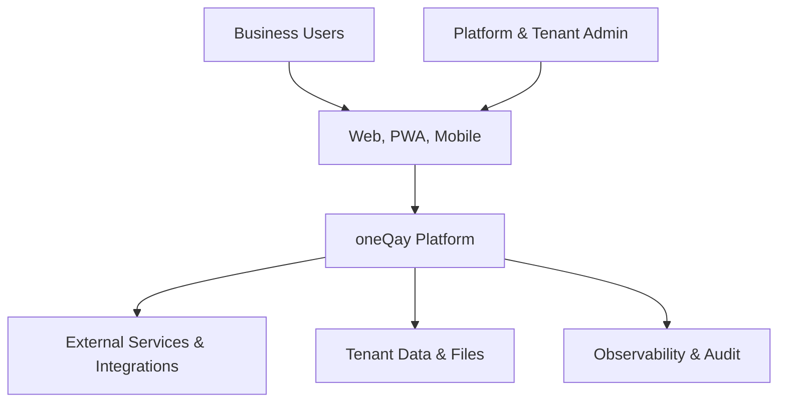
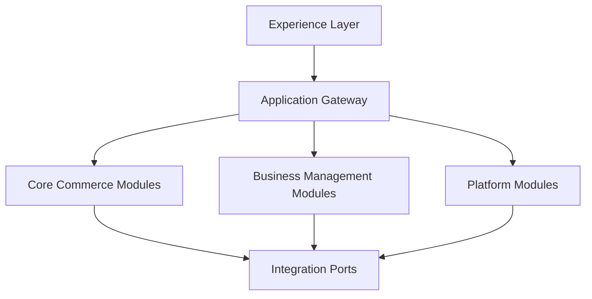
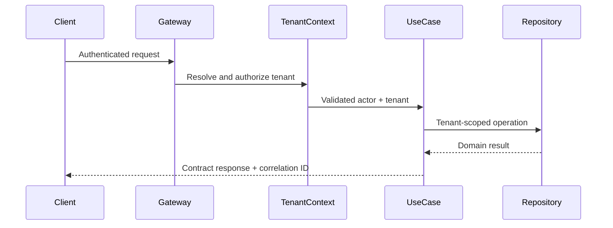

# oneQay Architecture

## Canonical post-Sprint42 source publication reconciliation — 2026-08-29

This current-facing section supersedes older post-Sprint41/current-state wording retained below as historical provenance. It records canonical source and CI evidence only and creates no new implementation or lifecycle authority.

- Functional canonical baseline reconciled by this docs-only publication: `6507927a258ab1378d6d3878e807b54cc9e6c5b2`; tree `69e165705483ebdca15e7ad66832d353beb390d8`; GitHub signature **verified / valid**.
- Sprint42 **First-Party Identity Disablement Session Termination Foundation** is **IMPLEMENTED / PUBLISHED** through PR #334 as `6507927a258ab1378d6d3878e807b54cc9e6c5b2`, from qualified exact source head `8fd104d817e2b473502f142198b24788e13afe41`.
- Sprint42 source remains exactly **8 paths** with sorted newline-terminated SHA-256 `6315890d318c3cdfca549bfacef6cb8d1ca66a4421416b49b4978095a98b6729`.
- Canonical source migrations remain exactly **#1–#15**. Sprint42 is **NO_SCHEMA_CHANGE**; migration #16 is not selected and does not exist.
- Sprint42 composes the existing Sprint41 authorized disable-only identity eligibility mutation with exact-tenant + exact-target active logical-session termination inside the canonical `PersistenceTransaction`. Successful fresh `applied`, fresh `no_change`, and exact replay outcomes re-enforce zero active target logical sessions before success without adding a public route or widening the Sprint41 payload.
- Sprint40 request-time identity authentication-eligibility revalidation remains an independent mandatory defense. Sprint36–Sprint39 session ownership, revocation, lifetime, tenant-membership, and organization/outlet/device revalidation semantics remain preserved.
- Sprint42 inserts no self-service session audit event, introduces no credential/factor/membership/grant mutation, and creates no enable/reactivation path.
- The bounded Sprint42 entry/schema/source-preservation and compatibility chain is published through PR #326–#333, #336, and #335. The final 19-workflow historical compatibility predecessor PR #335 is published as `fdbf30e2637dc71be16ac3f374f5973f104a3a9c`; PR #336 is published as `dea436904e56ed71353b56ab9b792762db2d95b7`.
- The final Sprint42 exact source head completed **29 materially triggered pull-request workflows / 29 success / 0 non-success**, and the exact-head `product-owner-merge-authority` status completed **success** before squash publication.
- Technical Preview remains **`NO_SCHEMA_CHANGE / SPRINT40 NOT ACTIVATED`**; Sprint41 migration #15 and Sprint42 source remain unactivated/unapplied in Technical Preview. Production remains **`NO-GO / NOT AUTHORIZED`**. Updater remains **`DISABLED / UNWIRED`**. Deployment and release remain **`NOT AUTHORIZED`**.
- No post-Sprint42 successor implementation concern is selected by this reconciliation. Any Sprint43 concern must begin with a separately bounded Product Owner entry gate; migration #16, new source/schema/runtime authority, reactivation, Preview/Production activation, updater wiring, deployment, and release are not implied.
- This reconciliation changes only the established **13-document canonical state envelope**, whose sorted newline-terminated path SHA-256 remains `b129d4b1c1135f2f5aecd5dde5ff1b5f6392eecb4d54006e80fc71889763647d`.

Attribution: **Lab | zefry**

## Canonical post-Sprint41 source publication reconciliation — 2026-08-27

This current-facing section supersedes older post-Sprint40/current-state wording retained below as historical provenance. It records canonical source and CI evidence only and creates no new implementation or lifecycle authority.

- Functional canonical baseline reconciled by this docs-only publication: `1994a7821846db9f872edb62a984c4248f766c1e`; tree `1eb7a9294eed86c6e3333f0db25ef9e3793aaaf0`; GitHub signature **verified / valid**.
- Sprint41 **First-Party Identity Authentication Eligibility Administration Foundation** is **IMPLEMENTED / PUBLISHED** through PR #315 as `1994a7821846db9f872edb62a984c4248f766c1e`, from qualified source head `fadd0c5bba83e4a2e2e209e1750de2224b7f3b68`.
- Sprint41 source remains exactly **12 paths** with sorted newline-terminated SHA-256 `b2c5fc10a8baa2d56991d6dbd36b0407159d70953654ef322a9a11d23660489b`.
- Canonical source migrations are exactly **#1–#15**. Migration #15 creates only the tenant-scoped `oneqay_identity_authentication_eligibility_mutations` journal; migrations #1–#14 remain immutable.
- Sprint41 implements only server-authorized `first_party_authentication_enabled: true -> false` administration for eligible ordinary same-tenant identities. No enable/reactivation, bulk mutation, protected-control disablement, administrator session revocation, credential mutation, factor mutation, membership mutation, or grant mutation authority exists.
- Sprint40 remains the independent request-time consumer of current authentication eligibility. Sprint41 does not weaken Sprint36–Sprint40 session, lifetime, organizational-access, or eligibility revalidation controls.
- Bounded historical/source compatibility closure required for source publication is merged through PR #316–#323, and the post-Sprint41 canonical-document preservation predecessor is published through PR #325. These PRs changed preservation/governance behavior only where applicable and created no runtime, deployment, updater, Preview, or Production authority.
- Canonical main-push oracle **M7.5 Technical Preview Release Artifact #338** (run `33095155642`) completed **SUCCESS** on `1994a7821846db9f872edb62a984c4248f766c1e`.
- Main-push **Backend Updater Control Plane Regression #121**, **Privileged Update Security Regression #123**, and **Read-Only Update Deployment UI Regression #106** also completed **SUCCESS** on the same canonical commit; these are regression evidence only.
- Technical Preview remains **`NO_SCHEMA_CHANGE / SPRINT40 NOT ACTIVATED`**; Sprint41 source and migration #15 are **not activated/applied** in Technical Preview. Production remains **`NO-GO / NOT AUTHORIZED`**. Updater remains **`DISABLED / UNWIRED`**. Deployment and release remain **`NOT AUTHORIZED`**.
- No post-Sprint41 successor implementation concern is selected or authorized by this reconciliation. Any next concern must begin with a separately bounded Product Owner entry gate; no Sprint42, migration #16, source, schema, runtime, Preview, Production, updater, deployment, or release authority is implied.

Attribution: **Lab | zefry**

## Canonical post-Sprint40 M7.5 preservation closure — 2026-08-27

This current-facing section supersedes older pre-Sprint40/current-state wording retained below as historical provenance. It records repository state only and creates no new implementation or lifecycle authority.

- Functional canonical baseline reconciled by this docs-only publication: `fe502ee40471633e292606ef203a2f0e90754175`; tree `6b494a9a152539a0e922bb564ff96930ff82d86c`; GitHub signature **verified / valid**.
- Sprint40 **First-Party Session Identity Disablement Revalidation Foundation** source is **IMPLEMENTED / PUBLISHED** through PR #286 as `03e86d4e677632a7516c8f4ed2c34045647b774a`, from qualified source head `c8d0f1ab6477f1c743247a519cbc1e6996365199`.
- The Sprint40 source envelope remains exactly **8 paths** with SHA-256 `a9caf2b68210a38687fee543256aec04dc1e67ee1ef403608f7db69139957ff8`.
- Canonical source migration files are exactly **#1–#14**. Migration #14 exists in source and adds only `first_party_authentication_enabled`; this does **not** authorize or imply schema application in Technical Preview or Production.
- Post-Sprint40 historical-regression preservation is published through PR #295 (Sprint32 horizon) and PR #296 (Sprint39 horizon). The bounded M7.5 seven-workflow correction is published through PR #297 and corrected for canonical-main push behavior through PR #298.
- The governed seven-workflow changed-path fingerprint remains `4784ffca1c940d3fa54a2a3988ead07e2de993bde8d3af2bd41014dbdf905be0`.
- Canonical main-push oracle **M7.5 Technical Preview Release Artifact #307** (run `33040247339`) completed **SUCCESS** on `fe502ee40471633e292606ef203a2f0e90754175`. Full-source tests, historical M7.2/M7.3 fixtures with temporary migration #10–#14 isolation, restoration verification, POS/Preview/background regressions, manifest/checksum validation, deterministic archive reproduction, artifact upload, and tracked-source cleanliness all succeeded.
- The oracle and generated qualification artifact are CI evidence only. **Technical Preview remains `NO_SCHEMA_CHANGE / SPRINT40 NOT ACTIVATED`; Production remains `NO-GO / NOT AUTHORIZED`; updater remains `DISABLED / UNWIRED`; deployment and release remain `NOT AUTHORIZED`.**
- PR #295–#298 changed workflow-governance/preservation behavior only; they did not add application source, apply schema, activate runtime, or grant standing successor authority.
- No post-Sprint40 successor implementation concern is selected or authorized by this reconciliation. Any next concern requires fresh canonical-main verification and separate bounded Product Owner authority.

Attribution: **Lab | zefry**

## Canonical Sprint40 pre-source architecture state — 2026-08-25

For current identity, security, session-control, schema, runtime, workflow, and next-work interpretation, this section supersedes older current-facing wording retained below as historical provenance.

- Sprint21 through Sprint39 governed foundations remain **COMPLETE / IMPLEMENTED / PUBLISHED** within their bounded authorities.
- Sprint40 selected concern is **First-Party Session Identity Disablement Revalidation Foundation**. Its entry gate is published through PR #268 and its schema/source-envelope gate is published through PR #270.
- Sprint40 source implementation is **NOT YET IMPLEMENTED / NOT YET PUBLISHED**. The source-preservation lineage through PR #271, supplemental historical compatibility PR #272/#273, and canonical-documentation synchronization preservation PR #274 establishes fail-closed qualification only; it creates no source/runtime authority by itself.
- Sprint40 request-time architecture requires the exact current first-party identity to remain independently eligible before an otherwise-valid logical session authority may continue. Identity eligibility is server-owned and cannot be supplied or widened by caller-controlled tenant, identity, organization, outlet, device, owner, or authority selectors.
- The selected future persistence change is migration #14, `apps/web/database/migrations/0000_00_00_000014_add_first_party_authentication_eligibility_to_identities.php`, adding only non-null boolean `first_party_authentication_enabled` default `true` to `oneqay_identities`. Migration #14 is **SELECTED / NOT YET CREATED / NOT APPLIED**; migrations #1-#13 remain immutable.
- The exact future source implementation envelope remains eight paths with sorted newline-terminated SHA-256 `a9caf2b68210a38687fee543256aec04dc1e67ee1ef403608f7db69139957ff8`. No route/API/payload, audit vocabulary, feature arm, config key, credential/factor mutation, organizational-verifier mutation, Technical Preview activation, Production activation, updater wiring, deployment, or release expansion is authorized by this documentation synchronization.
- This canonical documentation synchronization itself is exactly 13 documents with sorted newline-terminated changed-path SHA-256 `b129d4b1c1135f2f5aecd5dde5ff1b5f6392eecb4d54006e80fc71889763647d` and is documentation-only.
- `ONEQAY_AUTHENTICATION_SESSION_CONTROL_ENABLED=false` remains the source default. Technical Preview remains unactivated for Sprint40. Production remains **NO-GO / NOT AUTHORIZED**. Updater remains **DISABLED / UNWIRED**. Deployment and release remain **NOT AUTHORIZED**.

Historical architecture sections below remain preserved as provenance and must not override this section for current-state interpretation.

Attribution: **Lab | zefry**

## Canonical post-Sprint 33 program-state reconciliation — 2026-08-20

For current identity, security, recovery, schema, runtime, workflow, and next-work interpretation, this section supersedes older current-facing post-Sprint32 wording retained below as historical provenance.

- Sprint 21 through Sprint 33 governed control/identity foundations are **COMPLETE / IMPLEMENTED / PUBLISHED** within their bounded authorities.
- Sprint 33 Recovery-Bound Password Reset Completion Foundation is published through source PR #213 as `9eba56d92b4b714225d677990ffed93687b0b2cb` with tree `492e723b6343dab518b43645883976ad20f0054c`, parent `c89baa55318dca230cd0ef792df80e3d54b8165d`, and a verified/valid publication signature after **24/24** exact-head pull-request workflows succeeded.
- The qualified Sprint33 source head was `a7a50644cbe67e6f08138c79cf50a9350e8e220d`; source remained exactly **39 paths** with sorted-path SHA-256 `04a1177c12712183a7dda4ae81be1356c0e41294533336c9f999d376c224712a`.
- Sprint33 entry-gate PR #211 and source-envelope gate PR #212 remain published provenance; their authorities and PR #213 merge authority are consumed and grant no standing successor authority.
- Canonical source migrations remain exactly **#1 through #10** and are unchanged by Sprint33. No migration #11 is authorized.
- `ONEQAY_AUTHENTICATION_RECOVERY_ENABLED=false` remains the source default and recovery execution remains bounded to **Local/Test/CI**.
- Sprint32 proof still establishes only `password_reset_required` restricted state for exactly **600 seconds**; Sprint33 binds the consumed server-owned recovery `code_id` into that restricted evidence and exposes only `POST /auth/recovery/password-reset` inside the same bounded recovery arm.
- Reset accepts only opaque `password` input of **12–4096 bytes**, performs no trim/normalization, hashes with `PASSWORD_DEFAULT`, updates only the existing exact credential row, revokes remaining unused recovery codes, and appends exactly one secret-free `password_reset_completed` audit event atomically.
- Credential epoch is derived without schema change from the durable count of `password_reset_completed` rows. Fresh normal login captures the epoch; stale, malformed, negative, future, or post-reset legacy-missing epoch evidence fails closed as applicable.
- Protected-control principals and identities with confirmed privileged TOTP remain ineligible for recovery completion; TOTP secret material is not read, decrypted, replaced, deleted, or mutated.
- Successful reset invalidates the restricted session and regenerates CSRF but establishes no normal/full login, MFA evidence, step-up evidence, or epoch evidence; fresh normal login remains mandatory.
- Technical Preview remains **`NO_SCHEMA_CHANGE`**. Production remains **`NO-GO / NOT AUTHORIZED`**. Updater remains **`DISABLED / UNWIRED`**. Durable persistence remains source-default-disabled with `ONEQAY_PERSISTENCE_ENABLED=false`.
- Authenticated in-session password change, administrative password overwrite, MFA/TOTP recovery and factor lifecycle, protected-control recovery bypass, support/admin bypass, email/SMS recovery delivery, passkeys/WebAuthn, federation, API-token authentication, Preview/Production auth/schema activation, updater activation, deployment, and release remain separately governed.
- Sprint32 + Sprint33 now form a bounded Local/Test/CI end-to-end recovery sequence for eligible non-protected identities without confirmed privileged TOTP, but this does not activate recovery in Technical Preview or Production.
- This reconciliation selects **no new post-Sprint33 implementation concern** and grants no Sprint34, migration #11, source, Preview, Production, updater, deployment, or release authority.

The detailed factual baseline is `docs/ai/AI_POST_SPRINT_33_CANONICAL_STATE.md`. Historical sections below remain preserved as provenance and must not override this section for current-state interpretation.

Attribution: **Lab | zefry**

## Canonical post-Sprint 32 program-state reconciliation — 2026-08-19

For current identity, security, recovery, schema, runtime, workflow, and next-work interpretation, this section supersedes older current-facing post-Sprint30/post-Sprint31 wording retained below as historical provenance.

- Sprint 21 through Sprint 32 governed control/identity foundations are **COMPLETE / IMPLEMENTED / PUBLISHED** within their bounded authorities.
- Sprint 31 Privileged Reauthentication / Step-Up Session Freshness Foundation remains published with exact **300-second** freshness for the `policy_administration` scope and its source-default-disabled Local/Test/CI boundary.
- Sprint 32 Authentication Recovery / JRN-003 Recovery Proof Foundation is published through source PR #208 as `914f93f8636bbd0901c61d8a8f14ad69c2c8fbfe` with tree `89f8dcea209ea912ba2539f3c6224a3a0519c8f7`, parent `7f2cc64e5a85158fb24cf03b61d2b36ead73190a`, and a verified/valid publication signature after **24/24** exact-head pull-request workflows succeeded.
- Sprint 32 source remained within the exact **32-path** envelope whose sorted-path SHA-256 is `db230ab3b77fff67f0bd12d7d7b615146d9d9df9a0af12014214e1862e9f6867`.
- Canonical source migrations are exactly **#1 through #10**. Migrations #1–#9 remain immutable. Migration #10 creates only `oneqay_identity_recovery_codes` and `oneqay_identity_recovery_audit`. No migration #11 is authorized.
- `ONEQAY_AUTHENTICATION_RECOVERY_ENABLED=false` remains the source default and Sprint 32 recovery execution remains bounded to **Local/Test/CI**.
- Successful recovery-code rotation issues exactly **8** `rq1.<22-char selector>.<43-char secret>` codes, persists no plaintext recovery secret/code, and uses SHA-256 digest verification with `hash_equals` plus secret-free audit evidence.
- Recovery-code rotation and proof are atomic; same-code replay/concurrency is fail-closed with at most one winner.
- Successful recovery proof establishes only the restricted `password_reset_required` session for exactly **600 seconds**. It does **not** establish a normal/full authenticated session, does not populate the five canonical Sprint27 full-session keys, and does not read/decrypt the TOTP secret.
- Technical Preview remains **`NO_SCHEMA_CHANGE`**. Production remains **`NO-GO / NOT AUTHORIZED`**. Updater remains **`DISABLED / UNWIRED`**. Durable persistence remains source-default-disabled with `ONEQAY_PERSISTENCE_ENABLED=false`.
- Password reset/change/overwrite, automatic/full login from recovery proof, MFA/TOTP recovery, factor replacement/deletion, protected-control recovery, support/admin bypass, email/SMS recovery, passkeys, federation, API-token authentication, Preview/Production auth/schema activation, updater activation, deployment, and release authority remain separately governed and **NOT AUTHORIZED** by Sprint 32 or this reconciliation.
- Sprint 32 publishes the JRN-003 **recovery-proof foundation** only; this reconciliation does not claim end-to-end password recovery completion because password reset/change/overwrite remain excluded.
- This reconciliation selects **no new post-Sprint32 implementation concern** and grants no Sprint33, migration #11, source, Preview, Production, updater, deployment, or release authority. Any subsequent source work requires a separately bounded Product Owner entry gate.

The detailed factual baseline is `docs/ai/AI_POST_SPRINT_32_CANONICAL_STATE.md`. Historical sections below remain preserved as provenance and must not override this section for current-state interpretation.

Attribution: **Lab | zefry**

## Canonical post-Sprint 30 program-state reconciliation — 2026-08-19

For current identity, security, schema, runtime, workflow, and next-work interpretation, this section supersedes older current-facing post-Sprint28/post-Sprint29 wording retained below as historical provenance.

- Sprint 21 through Sprint 30 governed control/identity foundations are **COMPLETE / IMPLEMENTED / PUBLISHED** within their bounded authorities.
- Sprint 29 First-Control-Principal Bootstrap Credential Foundation is published through source PR #195 and closes the first protected-control credential circular dependency without credential overwrite, password recovery, or session creation.
- Sprint 30 Privileged TOTP MFA Foundation is published through PR #199 as `6d41755eba4030c2b0b7c4f3b7a5806b761b0ad7` with tree `bf1d56af5524e77919833bd64b585cdca84af55d` after **22/22** exact-head workflows succeeded.
- Sprint 30 source remained within the exact **46-path** envelope whose sorted-path SHA-256 is `95daaf86ba93ae797fccf3825d65d27acd4f71ee58916898a16fbc83d432a5ce`.
- Canonical source migrations are exactly **#1 through #9**. Migration #9 adds one tenant-scoped TOTP-factor row per identity with encrypted secret ciphertext and monotonic accepted-time-step replay state.
- The direct TOTP dependency is pinned to `spomky-labs/otphp` **11.5.0**; oneQay does not implement custom TOTP/HMAC/Base32 cryptography.
- `ONEQAY_PRIVILEGED_TOTP_MFA_ENABLED` remains source-default **false** and Sprint 29–30 delivery remains bounded to **Local/Test/CI**.
- For an armed protected-control principal, password verification alone does not establish the full privileged session. Restricted enrollment/challenge state is used until successful confirmed TOTP challenge establishes full session MFA evidence.
- TOTP secrets are Restricted, encrypted at rest, context-bound to tenant + identity, and never stored as plaintext. Accepted TOTP time steps advance monotonically to deny replay.
- Technical Preview remains **`NO_SCHEMA_CHANGE`**. Production remains **`NO-GO / NOT AUTHORIZED`**. Updater remains **`DISABLED / UNWIRED`**. Durable persistence remains source-default-disabled with `ONEQAY_PERSISTENCE_ENABLED=false`.
- Password change/reset/recovery, MFA recovery, factor replacement/deletion, multiple factors, WebAuthn/passkeys, federation, API-token authentication, Preview auth activation, and Production auth activation remain separately governed.
- **JRN-003 remains UNRESOLVED**; this reconciliation creates no password/MFA recovery path.
- The next logical governed identity/security concern is **Privileged Reauthentication / Step-Up Session Freshness Foundation**. DEC-006 already requires risk-based reauthentication/step-up for sensitive operations. This concern is **CANDIDATE / NOT AUTHORIZED** until a separate bounded entry gate freezes semantics, freshness evidence, session transitions, routes, exact source envelope, schema decision, and preservation tests.

The detailed factual baseline is `docs/ai/AI_POST_SPRINT_30_CANONICAL_STATE.md`. Historical sections below remain preserved as provenance and must not override this section for current-state interpretation.

Attribution: **Lab | zefry**

## Canonical post-Sprint 28 architecture reconciliation — 2026-08-18

For current architecture and identity/control-plane interpretation, this section supersedes older current-facing M7.5/updater-next-work wording retained below as historical provenance.

The published architecture now includes the bounded Sprint 21–28 chain in addition to the earlier M7 foundations:

- Sprint 21 — durable tenant-scoped role/permission policy;
- Sprint 22 — governed policy administration;
- Sprint 23 — initial tenant-administrator provisioning;
- Sprint 24 — protected-control administrator lifecycle;
- Sprint 25 — policy-administration delivery through durably re-verified session context;
- Sprint 26 — exact tenant + identity password credential verification;
- Sprint 27 — first-party login/logout and server-side session establishment;
- Sprint 28 — two-step initial password enrollment separating administrator authorization from target password selection.

The first-party credential/session/enrollment architecture is deliberately bounded to Local/Test/CI. Credential verification remains exact `(tenant_id, identity_id)`; session authority contains only verified identity/tenant/organization/outlet/device facts; role/permission authority is re-derived from durable policy; initial enrollment is insert-only and uses one-time digest-only tokens. No session, credential, or enrollment path grants updater authority.

Canonical migrations are exactly **#1 through #8**. Technical Preview remains **`NO_SCHEMA_CHANGE`** and does not wire Sprint 26–28 credential/login/enrollment delivery. Production remains **`NO-GO / NOT AUTHORIZED`**. Updater remains **`DISABLED / UNWIRED`**. Persistence remains default-disabled.

The next logical governed identity architecture concern is **First-Control-Principal Bootstrap Credential Foundation**. A new bounded entry gate is required before any implementation; this documentation synchronization creates no such authority.

The detailed canonical record is `docs/ai/AI_POST_SPRINT_28_CANONICAL_STATE.md`. Older M7.5/current architecture sections below remain historical provenance and must not override this section.

Attribution: **Lab | zefry**

## Canonical M7.5 lifecycle closure — 2026-08-17

For current architecture/runtime-state interpretation, this section supersedes the older current-facing consolidation retained below as historical planning/checkpoint text.

- M7.5 Preview Runtime Qualification is **CLOSED / EVIDENCE_COMPLETE / PUBLISHED**.
- The governed mandatory evaluator is **29 VERIFIED / 0 BLOCKED** after PR #129; PR #130 publishes secure cleanup without changing the evaluator.
- `ENGINE:TENANT_ISOLATION`, `ENGINE:RESTORE_VERIFIED`, and `RUNTIME:BACKUP_RESTORE` are **VERIFIED** within the bounded non-Production Technical Preview evidence catalog.
- The closure does not convert bounded Technical Preview qualification into Production infrastructure capability or Production recoverability.
- `lifecycle_authority_created=false` remains true for the M7.5 evidence package.
- M7.6, M7.7, Phase 0 Exit, Sprint 14, Release, and Production remain **NOT AUTHORIZED**; production readiness remains **NO-GO**.

The next candidate architecture workstream is a separately gated Secure Web Updater / release control plane that reuses existing updater, release, deployment, identity, configuration, health, and artifact foundations. No implementation, workflow, deployment, cPanel, database/schema/migration, restore, or later-lifecycle authority is created by this documentation closure.

Historical DEC-005R, DEC-009, architecture decisions, SHAs/PRs, and earlier M7.5 checkpoints below remain preserved.

Attribution: **Lab | zefry**

## Canonical program-state consolidation — 2026-08-16

For current architecture/runtime-state interpretation, this section supersedes older M7.5 and P1/P2 current-facing wording retained below as historical planning/checkpoint text.

- M7.5 is **IN PROGRESS / QUALIFICATION MATERIAL PROGRESS**.
- The governed evaluator after PR #124 is **26 VERIFIED / 3 BLOCKED**, overall **BLOCKED / INCOMPLETE**, with `lifecycle_authority_created=false`.
- The only remaining blockers are `ENGINE:RESTORE_VERIFIED:NOT_SUPPLIED`, `ENGINE:TENANT_ISOLATION:PARTIAL`, and `RUNTIME:BACKUP_RESTORE:PARTIAL`.
- Bounded P1/cPanel runtime evidence now verifies material web/runtime, relational, security, observability, rollback/recovery, scheduler, resource, background-execution, and Preview queue controls; this does not create general Production infrastructure capability.
- Existing application-level tenant isolation evidence remains material but does not yet prove the complete durable database-backed isolation semantics required for `ENGINE:TENANT_ISOLATION`.
- Backup/export and application release rollback evidence must not be conflated with successful database restore.
- M7.6, M7.7, Phase 0 Exit, Sprint 14, Release, and Production remain **NOT AUTHORIZED**; production readiness remains **NO-GO**.

This consolidation changes current-state representation only. DEC-005R, DEC-009, architecture decisions, historical SHAs/PRs, and additive evidence remain unchanged.

## Architecture goals

oneQay menggunakan **Modular Monolith First** dengan Clean Architecture dan Domain-Driven Design. Tujuannya adalah menyediakan sistem yang sederhana untuk dioperasikan pada tahap awal, namun memiliki boundary yang cukup kuat untuk berkembang tanpa menulis ulang business logic.

Enterprise Vision oneQay adalah **Enterprise Intelligent Business Management Platform** dan telah Approved melalui GOV-051. Enterprise Vision tidak mengubah implementation authority secara otomatis; bounded context, provider, physical schema, dan capability implementation tetap mengikuti keputusan dan authority masing-masing.

## Canonical product naming

Nama produk canonical adalah **oneQay**. Current/future-facing architecture text menggunakan `oneQay`; repository identifier `labzefry/oneQay`, immutable GitHub URLs, SHAs, historical commit messages, branch names, dan quoted historical evidence tidak ditulis ulang hanya untuk brand normalization.

## Context

## Enterprise Vision relationship

Architecture Direction adalah salah satu lapisan di bawah Enterprise Vision, bukan pengganti Product Vision atau Implementation Authority.

M6 memisahkan:

1. Product Vision;
2. Product Capability Map;
3. Product Architecture Direction;
4. Delivery Roadmap;
5. Implementation Authority.

Capability yang muncul pada `docs/handbook/ENTERPRISE_VISION.md` tidak otomatis menjadi module implementation atau Accepted bounded context.

## Logical layers

| Layer | Responsibility | Allowed dependency |
| --- | --- | --- |
| Domain | Entity, value object, invariant, domain service/event | Domain only |
| Application | Use case, orchestration, port, transaction boundary | Domain |
| Interface | HTTP, CLI, jobs, UI adapter, serialization | Application |
| Infrastructure | Database, cache, queue, storage, vendor integration | Application ports |

Dependency mengarah ke dalam. Domain dan application tidak boleh bergantung pada framework atau vendor.

## Modular topology

### Core commerce module candidates

- Organization, Outlet & Device
- Catalog & Pricing
- Inventory & Warehousing
- Sales & Point of Sale
- Purchasing & Supplier
- Customer & Loyalty

### Business management module candidates

- Finance & Accounting
- Reporting & Analytics
- Content Management

### Platform module candidates

- Tenant & Subscription
- Identity & Access Management
- Audit & Platform Operations
- Integration Hub
- Marketplace & Plugin Management
- AI Assistance

Daftar module candidate di atas tetap **Proposed** sampai domain discovery dan ADR/decision yang berlaku menyetujuinya. Enterprise Capability Map tidak mempromosikan daftar tersebut menjadi physical modules.

## Enterprise capability projection

Untuk menjaga hubungan dengan Enterprise Vision tanpa mengubah bounded-context status, architecture mengakui capability families berikut sebagai directional projection:

- **Core Business Platform:** Tenant & Organization, Identity & Access, Master Data, POS / Commerce, Inventory, Procurement, Finance / Accounting, CRM, HRM, Reporting & Business Intelligence.
- **Platform Capabilities:** Workflow, Notification, Audit, File / Document, Search, API, Integration, Webhook/Event Integration, Configuration, Localization, Observability, Recovery & Operational Control.
- **Extensibility:** Marketplace, Plugin / Extension, Public API, Partner Integration.
- **AI Platform:** AI Assistant, AI Insight, AI Automation, AI Recommendation, AI Analytics, AI Gateway / Policy Boundary.
- **Channels:** Web Application, PWA, Mobile / Android, Admin Platform, public/customer-facing surfaces, API/partner consumers.

These capability families are not physical module declarations and do not authorize implementation.

## Module contract

Setiap modul yang diotorisasi harus memiliki:

- bounded context dan ubiquitous language;
- public application interface;
- owned schema/table namespace;
- authorization policy;
- domain events;
- failure semantics;
- observability signals;
- test boundary;
- owner dan lifecycle status.

Modul tidak boleh membaca atau menulis tabel milik modul lain secara langsung. Interaksi sinkron melalui application contract; interaksi asinkron melalui event/outbox.

## Request flow

## Multi-tenant architecture

Tenant context terdiri dari immutable tenant ID, actor, roles/permissions, outlet scope, timezone, currency, locale, subscription entitlement, dan correlation ID.

Enforcement wajib terjadi pada:

- authentication dan tenant membership;
- authorization policy;
- repository/query boundary;
- cache key dan lock;
- queue/job payload;
- object storage path;
- search index;
- event envelope;
- audit log dan metrics dimension.

Cross-tenant operation hanya tersedia pada platform administration yang eksplisit, diaudit, menggunakan step-up authentication, dan memiliki purpose limitation.

M7.2 telah mempublikasikan bounded Tenant Kernel & Isolation Foundation untuk Local/Test/CI. M7.3 kemudian mempublikasikan bounded first-party identity dan organization/outlet/device context minimum dengan identity tetap terpisah dari tenant membership dan relationship authority tetap server-controlled. Publication facts tersebut tidak mengubah final persistence/schema authority.

## Data architecture

- **Portable Relational Persistence Architecture** adalah current canonical relational architecture melalui DEC-005R.
- Domain dan Application harus database-engine-neutral; business rules tidak boleh bergantung pada vendor database.
- Target perpindahan antar officially qualified relational engine profiles adalah **ZERO BUSINESS-CODE CHANGE**; perbedaan engine tetap menjadi concern Configuration/Infrastructure.
- MariaDB, MySQL, dan PostgreSQL adalah authorized engine-profile directions; engine/profile identity sendiri bukan runtime qualification.
- MariaDB 11.4 family adalah Stage-1 profile direction subject to DEC-009/M7.5 runtime qualification.
- Canonical logical schema/contract dipisahkan dari engine-specific physical mapping.
- Formal Database Portability Contract, cross-engine qualification, dan oneQay Database Mobility & Migration Engine — DBME adalah approved architecture directions tetapi belum diimplementasikan.
- Default physical tenancy tetap shared database/shared schema dengan mandatory immutable tenant isolation key, dipertahankan dari DEC-005 oleh DEC-005R.
- Tenant authorization tetap Application-authoritative; database integrity/security adalah defense-in-depth.
- Transaksi tidak boleh melintasi boundary secara implisit.
- Outbox pattern disiapkan untuk reliable domain event publication.
- Cache bukan source of truth dan harus tenant-aware.
- File/object storage menggunakan generated identifier, content validation, malware scanning, dan signed access.
- Analytics workload dipisahkan saat beban membenarkan; OLTP tidak boleh menjadi reporting warehouse tanpa kontrol.

DEC-005 tetap historical Approved decision dan **PARTIALLY SUPERSEDED BY DEC-005R**: D-005-01/D-005-02 superseded, D-005-03/D-005-04/D-005-05/D-005-08 preserved, D-005-06/D-005-07 preserved and expanded, dan D-005-09 materially expanded. DEC-005R tidak memberi final business schema, executable SQL/migration, engine adapter, DBME implementation, Production database, provider, atau database-configuration authority. M7.0–M7.4A juga tidak mengotorisasi physical schema coupling.

## API architecture

- REST API menggunakan versioned contract.
- Internal dan public API dipisahkan secara policy dan lifecycle.
- Error menggunakan stable code, correlation ID, dan safe message.
- Operasi finansial menggunakan idempotency key.
- Pagination wajib cursor-based untuk collection besar.
- Webhook ditandatangani, replay-protected, retryable, dan dapat diaudit.

Public API dan partner ecosystem tetap mengikuti capability/decision gate terpisah.

## Event-driven readiness

Domain event menggunakan envelope minimum: event ID, type, version, occurred at, tenant ID, actor/correlation/causation ID, dan payload. Event bersifat immutable. Consumer harus idempotent dan mendukung dead-letter/replay policy.

Event bus eksternal belum diwajibkan pada shared hosting. Implementasi awal dapat menggunakan transactional outbox dan worker terjadwal, selama application contract tetap sama.

## Integration architecture

Semua vendor ditempatkan di adapter melalui port. Adapter wajib memiliki timeout, bounded retry, circuit breaker bila tersedia, idempotency, rate limit awareness, audit, metric, dan failure mapping.

Provider atau vendor spesifik tidak menjadi keputusan Accepted hanya karena muncul dalam historical planning atau integration examples.

## Plugin architecture

Plugin system berstatus Deferred sampai trust model disetujui. Sebelum aktif, harus tersedia:

- signed manifest/package;
- compatibility dan capability declaration;
- tenant-scoped installation;
- permission grant dan revocation;
- resource quota;
- isolation/sandbox strategy;
- lifecycle, upgrade, rollback, dan kill switch;
- marketplace review serta audit.

Plugin tidak boleh memperoleh akses database langsung.

## AI architecture

AI capabilities wajib melalui controlled internal policy boundary yang menangani provider abstraction, data policy, redaction, tenant isolation, prompt/version registry, retrieval authorization, budget, rate limit, observability, human confirmation, evaluation, dan safe fallback sesuai capability yang diotorisasi.

AI tidak boleh menjadi source of truth untuk transaksi, otorisasi, accounting posting, inventory mutation, tenant-boundary decision, atau tindakan irreversible. Output berisiko tinggi memerlukan deterministic validation dan human approval.

No AI provider or AI automation implementation is authorized merely by Enterprise Vision or M7 progression.

## Deployment architecture

Business logic dan module contract harus identik pada seluruh stage:

1. Shared Hosting / cPanel
2. VPS
3. Dedicated Server
4. Docker
5. Cloud
6. Kubernetes

Perbedaan stage ditangani oleh configuration dan infrastructure adapter. Session, cache, file, job, scheduler, dan relational engine profile harus dapat berubah melalui Infrastructure/Configuration tanpa menulis ulang use case/business rules.

DEC-009 defines the capability-based Stage-1 Preview runtime requirements. Its database dependency is reconciled by DEC-005R: Stage 1 requires an authorized **and runtime-qualified** relational engine profile rather than sole canonical MySQL Server. P1 Shared Hosting/cPanel remains conditional/not selected; observed MariaDB 11.4 is engine-family/version evidence only, not runtime qualification. P2 Managed/Hardened VPS or Server remains the fallback execution class. Actual P2 target evidence is pending external input unless fresh evidence proves otherwise. Neither DEC-009, DEC-005R, nor M7.0–M7.4A authorizes deployment execution or production release.

## Reliability

- Request memiliki timeout dan correlation ID.
- Retry hanya untuk kegagalan transient dan operasi idempotent.
- Long-running task dipindahkan ke background job.
- Health check dibagi menjadi liveness, readiness, dan dependency diagnostics sesuai kemampuan environment.
- Backup tidak dianggap valid sebelum restore test lulus.
- Recovery objective ditetapkan per capability sebelum production launch.

## Observability

Log terstruktur tidak boleh memuat secret atau payload sensitif. Metrics minimum mencakup request rate/error/duration, job status, database saturation, cache, external dependency, tenant isolation denial, authentication, dan business critical events. Distributed tracing diperkenalkan saat arsitektur mendukungnya.

## Security architecture

Gunakan deny-by-default authorization, least privilege, MFA untuk privileged roles, secure session, CSRF protection, input validation, output encoding, encryption in transit/at rest, secret rotation, audit log immutable, dependency scanning, dan threat modeling untuk flow kritis.

M7.1 application/configuration foundation, M7.2 tenant isolation foundation, M7.3 identity/organizational-context foundation, M7.4 POS transaction authority, dan M7.4A Technical Preview interaction layer harus dipertahankan oleh successor work. Identity tidak boleh disamakan dengan tenant membership; tenant membership dan organization/outlet/device relationship harus tetap server-controlled. Pricing dan exact-money tetap server-authoritative; M7.4A menggunakan existing M7.4 `CompleteSyntheticSale` authority, `CASH` tetap `CASH_COUNTED`, dan `MANUAL_EXTERNAL` tetap `OPERATOR_RECORDED`, bukan `PROVIDER_VERIFIED`.

## Architecture fitness functions

- Domain layer bebas import infrastructure/framework.
- Domain/Application tidak boleh mengimpor database-vendor details.
- Tidak ada query data tenant tanpa enforced tenant scope.
- Tidak ada akses tabel lintas module tanpa keputusan arsitektur.
- Public contract memiliki version dan test.
- Semua migration yang diotorisasi harus terurut serta tervalidasi.
- Future engine-profile qualification harus membuktikan Database Portability Contract tanpa mengubah business code.
- Unsafe/lossy cross-engine conversion harus fail closed.
- Dependency cycle memblokir build.
- Secret scan dan high-severity security gate memblokir release.
- Capability map tidak boleh digunakan sebagai pengganti implementation authority.
- Current/future-facing brand reference harus menggunakan `oneQay`.
- Identity, tenant membership, and organizational authority remain separate server-controlled boundaries.

## Decision process

Keputusan signifikan dicatat di `docs/adr/ADR-NNN-title.md` dengan status Proposed, Accepted, Superseded, atau Rejected. ADR wajib untuk technology stack, tenancy model, auth, database, payment, event transport, plugin isolation, AI provider, dan perubahan deployment architecture.

## Current decision posture

Current canonical state reflects the separately governed decisions already published:

- DEC-005: **Approved Historical Decision / Partially Superseded by DEC-005R**;
- DEC-005R: **Approved / Decision Complete** — current Portable Relational Persistence Architecture;
- ADR-003: **Accepted**, current representation reconciled to DEC-005R while historical D1 and DEC-005 provenance remain preserved;
- DEC-009 / ADR-007: **Approved / Accepted**, database runtime dependency reconciled to DEC-005R;
- ADR-001, ADR-002, ADR-004, ADR-005, ADR-006, and ADR-008 retain their separately governed Accepted state;
- GD-007: Proposed;
- JRN-003 and JRN-013: Unresolved;
- final business schema and executable migrations: not authorized;
- engine-profile runtime implementation, cross-engine CI, and DBME implementation: not authorized;
- provider-specific Production implementation: not authorized.

Open future architecture work includes plugin trust model, AI provider/data policy, final business schema details, relational engine-profile/runtime qualification, portable Infrastructure adapter implementation, cross-engine qualification/CI, DBME implementation, and other capability decisions only when their entry criteria and separate authority are available.

## Historical Technical Preview candidate architecture

The following profile is preserved as a **historical Proposed Technical Preview candidate recorded through Issue #23**. It must not override later Accepted decisions or the governed M7.0 Controlled Implementation Bridge.

- Delivery shape: Laravel/PHP modular monolith with domain/application boundaries independent of framework and infrastructure.
- Web client: Vue 3, Inertia, and Vite in one preview deployment unit.
- Historical data wording: MySQL-compatible shared schema with mandatory validated tenant identity and composite integrity strategy; DEC-005 later established canonical MySQL Server and shared database/shared schema direction; DEC-005R subsequently supersedes sole-MySQL status with Portable Relational Persistence Architecture while preserving the shared-schema/tenant-isolation direction.
- Historical identity wording: first-party revocable session, CSRF protection, and privileged-role TOTP baseline; DEC-006 later established the canonical auth/session direction.
- Payment: synthetic cash-only historical Preview boundary; DEC-007 later established cash-first + configurable manual/external recorded tender architecture while real provider processing remains outside current Preview authority.
- Connectivity: online-authoritative transactional mutation, consistent with DEC-008 first-MVP direction.
- Deployment: historical P1/P2 planning; DEC-009 later established capability-based Stage-1 Preview requirements with P1 conditional/not selected and P2 fallback execution class; DEC-005R later reconciled its database dependency to qualified relational engine profiles.
- Recovery: provisional RPO 24 hours and RTO 4 hours for synthetic sandbox data remain historical Technical Preview provenance, not Production commitments.
- SLO: zero cross-tenant exposure, 99% scheduled demo-window availability, and proposed p95 server response at or below 750 ms for the agreed preview load remain historical/proposed Preview provenance.

Architectural fitness for this preview requires two-tenant negative isolation tests, server-side deny-by-default authorization, exact money representation, idempotent retry boundaries, tenant-aware cache/job/file/audit behavior, deterministic migration/seeder rehearsal when separately authorized, secret isolation, versioned deployment, and backup/restore/rollback evidence before applicable runtime acceptance.

Historical Issue #23 text that described ADR-001 through ADR-007 as Proposed is preserved only as planning history. Current canonical ADR state follows their separately governed decision reconciliations. JRN-003 and JRN-013 remain unresolved.

## M7 current architecture position

- M7.0 — Controlled Implementation Bridge: DONE / PUBLISHED.
- M7.1 — Application Skeleton & Configuration Boundary: DONE / PUBLISHED through PR #92.
- M7.2 — Tenant Kernel & Isolation Foundation: DONE / PUBLISHED through PR #93.
- M7.3 — Identity / Organization / Outlet / Device Minimum: DONE / PUBLISHED through PR #94.
- M7.4 — POS Core Synthetic Vertical Slice: DONE / PUBLISHED through PR #96.
- M7.4A — Technical Preview Interaction Layer: DONE / PUBLISHED through PR #98.
- M7.5 — Preview Runtime Qualification: BLOCKED / NOT AUTHORIZED pending actual sanitized P2 target evidence and DEC-009 capability verification, including selected relational engine-profile qualification under DEC-005R.
- M7.6 — Preview Deployment / Recovery Rehearsal: BLOCKED / NOT AUTHORIZED.
- M7.7 — Technical Preview Acceptance: BLOCKED / NOT AUTHORIZED.

Track A Controlled Application Engineering has published M7.4 and the bounded M7.4A interaction layer. M7.4A connects synthetic sign-in → server-verified tenant/outlet context → synthetic catalog → cart → `CASH` / `MANUAL_EXTERNAL` → existing M7.4 `CompleteSyntheticSale` → receipt preview, within synthetic-only Local/Test/CI/explicit Preview boundaries. Track B Preview Runtime Qualification remains separately gated and cannot begin until actual sanitized P2 target evidence is available for DEC-009 verification and separate Product Owner authority is granted. Both tracks converge before Preview deployment/acceptance.

DEC-005R publication changes database architecture governance only; it does not promote any M7 lifecycle state.

## Current authority boundary

- Phase 0: In Progress.
- Phase 0 Exit: Not Approved.
- Sprint 12: Published.
- Sprint 13: Published.
- Sprint 14: Not Authorized.
- M7.4 source implementation: DONE / PUBLISHED through PR #96; no standing successor authority.
- M7.4A Technical Preview Interaction Layer: DONE / PUBLISHED through PR #98; no standing M7.5, deployment, release, or Production authority.
- M7.5 Preview Runtime Qualification: BLOCKED / Not Authorized pending actual sanitized P2 target evidence and DEC-009 capability verification.
- Final/business/production application implementation: Blocked unless separately authorized.
- SQL/migration execution: Not Authorized.
- Production database modification: Not Authorized.
- DBME/cross-engine CI implementation: Not Authorized.
- Deployment/release: Not Authorized.
- Production: Not Authorized.
- Production readiness: NO-GO.

Attribution: Lab | zefry
