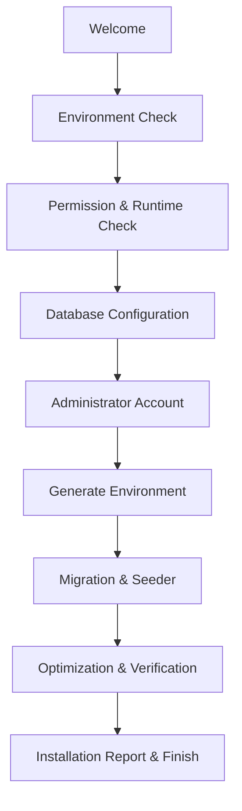

# oneQay Installer Specification

## Current cPanel same-source staging bundle — Sprint217

The cPanel no-SSH operator path is now bound to the Sprint216 same-source durable-staging release rather than the historical Sprint211 bundle.

Current governed application release:
- artifact ID `10603323419`
- release `durable-staging-d0b5becbf945`
- source `d0b5becbf945c5192e797d512a704eb5aecc6eaa`
- archive SHA-256 `e32a7de2c07c35306c03edff5d7d762782ef58449c92d4b88e5dd04b50d489a2`
- deployment handoff state `VALIDATED_FOR_EXTERNAL_DEPLOYMENT_NOT_AUTHORIZED`

The operator must always use the archive identity in the current kit `KIT.json`. No Sprint number is a substitute for exact release identity.

This rebind is required so real durable-staging evidence can be produced for the same source as Production candidate artifact `10603358335`. It grants no deployment or Production activation authority.

## cPanel no-SSH guarded deployment execution — Sprint214

Sprint214 closes the execution gap after Sprint212 qualification and Sprint213 kit publication. A cPanel operator without SSH can now execute the exact Sprint207 plan through one-shot Cron/PHP CLI without a public web deployment endpoint.

Before requesting short-lived Sprint208 authority, the operator may upload the exact application archive identified by the current cPanel kit into a **private operator workspace** through File Manager. Uploading the archive to that private workspace does not activate or extract the release. Archive extraction into the qualified release root occurs only after the Sprint214 executor has revalidated the current authority and exact artifact SHA-256.

The real execution command is:

```text
<PHP_CLI> tools/cpanel/execute-durable-staging-cpanel-no-ssh-deployment.php \
  <deployment-plan.json> \
  <target-profile.json> \
  <durable-staging-archive.tar.gz> \
  <private-bindings.json> \
  <private-runtime-env> \
  <https-readiness-url> \
  <deployment-evidence.json>
```

The executor:

- revalidates the deterministic Sprint207 plan fingerprint;
- rejects expired/not-current authority;
- verifies the exact archive SHA-256;
- extracts into the immutable release root only after authority validation;
- rejects any embedded `.env`;
- binds the private Laravel runtime environment by symlink from the shared-runtime root;
- atomically points the cPanel active-release symlink to the new release;
- verifies that the domain document root resolves to the new release `apps/web/public`;
- performs authenticated HTTPS readiness using the private attestation token;
- rehearses rollback to the previous active state;
- reactivates the new release and performs readiness again;
- writes Sprint209-compatible `DEPLOYED_VERIFIED_NOT_SELECTED` evidence only after all checks succeed.

For a first deployment to an empty target, the previous active state is `ABSENT`. Rollback rehearsal removes the new active pointer, verifies the original absent state, then reactivates the new release. For a rolling deployment, the previous active symlink target must remain inside the qualified release root and is restored during rollback rehearsal.

If execution fails after active-pointer mutation, the executor attempts to restore the previous active state and does not emit successful deployment evidence. Failed inactive release directories may remain for controlled forensic cleanup.

The runtime environment file and private binding file must be owner-only, remain under the qualified shared-runtime root, and stay outside the public document root. The readiness URL must be HTTPS. Migration #27 remains unexecuted.


## cPanel no-SSH operator qualification kit publication — Sprint213

Sprint213 packages the Sprint212 cPanel no-SSH qualification path into one operator-retrievable deterministic ZIP so a shared-hosting operator does not need Git, SSH, or manual raw-file collection from the repository.

The kit is published only from canonical `main` through GitHub Actions and contains:

- the Sprint212 cPanel target inspector;
- the Sprint212 target-candidate bridge;
- the cPanel observed-profile schema;
- Sprint208 target-candidate, authority-request, authority, and qualified-target schemas/tools;
- the Sprint207 deployment-plan builder and schema;
- the Sprint209 deployment-evidence qualifier and schema;
- non-secret target-input and private-bindings templates;
- an operator README;
- an internal per-file SHA-256 manifest;
- an external ZIP SHA-256 sidecar.

The ZIP deliberately does **not** contain oneQay application runtime bytes. The current governed application release is the exact durable-staging bundle identified in `KIT.json`; it provides the archive, manifest, checksum, and deployment handoff. Historical Sprint211 references are not current release authority.

For cPanel without SSH, the operator uses File Manager to upload/extract the qualification ZIP into a private workspace outside the document root. One-shot Cron Jobs run the PHP CLI commands from the kit README. Private bindings and short-lived approval-token material must use private host files and must never be embedded in the ZIP, repository, Cron command value, or public document root.

The approval token may be stored only temporarily in a private file and piped to the Sprint208 authority qualifier through STDIN. Delete that token file immediately after the qualification attempt.

Publication of the kit is not target creation, deployment authority, application deployment, migration authority, target selection, or producer-dispatch authority.


## cPanel no-SSH durable-staging qualification — Sprint212

Sprint212 provides a fail-closed bridge for shared hosting/cPanel accounts that do not expose SSH or an interactive terminal. The supported operator channel is **cPanel File Manager + one-shot Cron Jobs + PHP CLI**. It does not add a public web installer route and does not grant deployment authority.

The operator prepares, through File Manager, an isolated non-production target tree plus a private bindings file outside the domain document root. The bindings file must be readable only by the account owner (`0600` or stricter group/world exposure). A one-shot cPanel Cron entry runs:

```text
php tools/cpanel/inspect-durable-staging-cpanel-no-ssh-target.php \
  <target-input.json> \
  <private-bindings.json> \
  <target-profile.json>
```

The inspector rejects unsupported PHP (< 8.2), missing `json`, `openssl`, `PDO`, `pdo_mysql`, or `Phar`, non-private binding files, path escapes/collisions, unwritable deployment roots, missing atomic rename, unavailable PHP symlink support, mismatched release/runtime identity, missing required bindings, and unconfirmed operator capabilities. Secret values are never emitted.

A qualified profile is converted into the existing Sprint208 target-candidate schema:

```text
php tools/cpanel/prepare-durable-staging-cpanel-no-ssh-target-candidate.php \
  <target-profile.json> \
  <target-candidate.json>
```

The cPanel path is accepted only when the domain document root is shaped as `<active-release-pointer>/apps/web/public`, the deployment/release/shared roots are isolated from public serving, and the provider permits the required PHP, Cron, filesystem, and symlink semantics. A dedicated cPanel account or otherwise isolated domain tree is preferred so the parent `public_html` surface cannot expose private runtime material.

If the provider disables Cron Jobs, PHP CLI, required extensions, symlink creation, atomic rename, or an isolated document-root layout, the host is **not qualified** under this adapter. The operator must choose another target class or introduce a separately reviewed bounded adapter; no compatibility value may be fabricated.

Sprint212 performs qualification only. It does not create hosting, extract the durable artifact, mutate runtime configuration, update the active-release pointer, run migration #27, provision permissions, activate Final Shift Close, select a target, dispatch the producer, activate Technical Preview/Production, or activate the updater.


## Purpose

Installer Wizard menyediakan pemasangan oneQay yang repeatable, secure, auditable, recoverable, dan dapat digunakan pada shared hosting/cPanel tanpa mengunci arsitektur pada lingkungan tersebut.

## Trust boundary

Installer adalah privileged surface. Installer hanya menerima release artifact resmi yang lolos integrity verification. Setelah instalasi selesai, installer dikunci/dinonaktifkan dan tidak dapat dibuka kembali tanpa controlled recovery procedure.

## Preconditions

- Release version dan compatibility metadata tersedia.
- Package checksum/signature dapat diverifikasi.
- System requirements terdokumentasi.
- Database kosong atau status upgrade dikenali.
- HTTPS dan secure configuration path tersedia.
- Operator memahami backup/rollback dan tidak memasukkan secret melalui channel tidak aman.

## Wizard flow



## Step specifications

### 1. Welcome

Tampilkan product/version, documentation, requirements, privacy/security warning, support reference, dan acknowledgement bahwa backup diperlukan bila target tidak kosong.

### 2. Environment check

Periksa OS/runtime/web server interface, version compatibility, memory, execution time, disk, HTTPS, DNS/time, outbound connectivity allowlist, scheduler/cron, archive capability, temp directory, dan required command/tool sesuai deployment target.

### 3. PHP extension check

Jika ADR menetapkan PHP, periksa runtime dan extension minimum yang dideklarasikan release manifest. Installer tidak boleh mengasumsikan extension berdasarkan hardcode yang tidak diversi. Jika backend bukan PHP, step ini diganti runtime dependency check yang setara tanpa mengubah tujuan wizard.

### 4. Permission check

Periksa hanya directory yang memang membutuhkan write. Hindari permission global/world-writable. Beri exact path, current/required state, remediation, dan recheck. Secret/config serta storage tidak boleh berada di public document root bila platform memungkinkan.

### 5. Database configuration

Terima host/socket, port, database, credential, TLS mode, dan prefix/schema bila disetujui. Test connection menggunakan least-privilege account. Credential tidak tampil kembali atau dicatat. Validasi engine/version/charset/timezone dan empty/recognized state.

### 6. Administrator account

Buat platform bootstrap administrator dengan unique identity, strong password policy, optional/required MFA enrollment sesuai security baseline, recovery guidance, dan audit entry. Default password atau known credential dilarang.

### 7. Generate environment

Generate cryptographic keys menggunakan secure random source, tulis config secara atomic dengan restrictive permission, simpan only necessary secret, dan tampilkan backup/recovery instruction tanpa membocorkan nilai.

### 8. Migration

Acquire installation lock, validate migration graph, buat backup bila applicable, jalankan migration terurut, rekam version/checksum/duration, stop safely pada failure, dan verifikasi schema/invariant.

### 9. Seeder

Seeder production hanya membuat mandatory reference/configuration data dan bootstrap objects. Demo/test data dilarang kecuali mode eksplisit non-production. Seeder harus deterministic dan rerun-safe.

### 10. Optimization

Generate cache/autoload/assets sesuai stack, register scheduler/worker instructions, set secure production mode, dan clear installation temporary data. Optimization gagal tidak boleh disamarkan sebagai success.

### 11. Installation report

Report berisi version, timestamp, environment summary non-sensitif, checks, migration result, admin identity reference, scheduler/worker actions, warnings, health result, config backup instruction, dan correlation ID. Secret harus direduksi.

### 12. Finish

Lock installer, remove/disable installer route, verify login/tenant bootstrap/audit/health, dan tampilkan next action. Finish hanya aktif jika mandatory checks lulus.

## State machine and recovery

Installer menyimpan non-secret checkpoint agar proses interrupted dapat resume atau rollback. Concurrent installer diblokir. Setiap step idempotent atau memiliki compensation. Operator dapat mengunduh safe report tanpa credential.

## Security controls

- CSRF/session protection dan brute-force limit.
- Access token/one-time setup gate bila installer web-exposed.
- No shell injection, path traversal, unsafe archive extraction, SSRF, atau raw error.
- Redacted logs dan correlation ID.
- Installer source/package tidak menerima arbitrary remote URL.

## Required tests

Clean install, unsupported runtime, missing extension, permission denial, database failure, wrong charset/version, interrupted migration, seeder rerun, disk full, invalid package, concurrent run, report redaction, installer lock, dan recovery.

## Definition of Done

Clean-room installation lulus pada supported matrix, failure aman dan actionable, secret tidak bocor, migration/health/report valid, installer terkunci, documentation dan support runbook tersedia.
