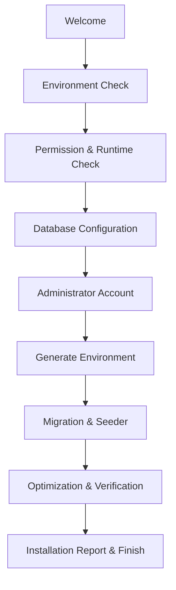

# oneQay Installer Specification

## Purpose

Installer Wizard menyediakan pemasangan oneQay yang repeatable, secure, auditable, recoverable, dan dapat digunakan pada shared hosting/cPanel tanpa mengunci arsitektur pada lingkungan tersebut.

## Trust boundary

Installer adalah privileged surface. Installer hanya menerima release artifact resmi yang lolos integrity verification. Setelah instalasi selesai, installer dikunci/dinonaktifkan dan tidak dapat dibuka kembali tanpa controlled recovery procedure.

## Preconditions

- Release version dan compatibility metadata tersedia.
- Package checksum/signature dapat diverifikasi.
- System requirements terdokumentasi.
- Database kosong atau status upgrade dikenali.
- HTTPS dan secure configuration path tersedia.
- Operator memahami backup/rollback dan tidak memasukkan secret melalui channel tidak aman.

## Wizard flow

## Step specifications

### 1. Welcome

Tampilkan product/version, documentation, requirements, privacy/security warning, support reference, dan acknowledgement bahwa backup diperlukan bila target tidak kosong.

### 2. Environment check

Periksa OS/runtime/web server interface, version compatibility, memory, execution time, disk, HTTPS, DNS/time, outbound connectivity allowlist, scheduler/cron, archive capability, temp directory, dan required command/tool sesuai deployment target.

### 3. PHP extension check

Jika ADR menetapkan PHP, periksa runtime dan extension minimum yang dideklarasikan release manifest. Installer tidak boleh mengasumsikan extension berdasarkan hardcode yang tidak diversi. Jika backend bukan PHP, step ini diganti runtime dependency check yang setara tanpa mengubah tujuan wizard.

### 4. Permission check

Periksa hanya directory yang memang membutuhkan write. Hindari permission global/world-writable. Beri exact path, current/required state, remediation, dan recheck. Secret/config serta storage tidak boleh berada di public document root bila platform memungkinkan.

### 5. Database configuration

Terima host/socket, port, database, credential, TLS mode, dan prefix/schema bila disetujui. Test connection menggunakan least-privilege account. Credential tidak tampil kembali atau dicatat. Validasi engine/version/charset/timezone dan empty/recognized state.

### 6. Administrator account

Buat platform bootstrap administrator dengan unique identity, strong password policy, optional/required MFA enrollment sesuai security baseline, recovery guidance, dan audit entry. Default password atau known credential dilarang.

### 7. Generate environment

Generate cryptographic keys menggunakan secure random source, tulis config secara atomic dengan restrictive permission, simpan only necessary secret, dan tampilkan backup/recovery instruction tanpa membocorkan nilai.

### 8. Migration

Acquire installation lock, validate migration graph, buat backup bila applicable, jalankan migration terurut, rekam version/checksum/duration, stop safely pada failure, dan verifikasi schema/invariant.

### 9. Seeder

Seeder production hanya membuat mandatory reference/configuration data dan bootstrap objects. Demo/test data dilarang kecuali mode eksplisit non-production. Seeder harus deterministic dan rerun-safe.

### 10. Optimization

Generate cache/autoload/assets sesuai stack, register scheduler/worker instructions, set secure production mode, dan clear installation temporary data. Optimization gagal tidak boleh disamarkan sebagai success.

### 11. Installation report

Report berisi version, timestamp, environment summary non-sensitif, checks, migration result, admin identity reference, scheduler/worker actions, warnings, health result, config backup instruction, dan correlation ID. Secret harus direduksi.

### 12. Finish

Lock installer, remove/disable installer route, verify login/tenant bootstrap/audit/health, dan tampilkan next action. Finish hanya aktif jika mandatory checks lulus.

## State machine and recovery

Installer menyimpan non-secret checkpoint agar proses interrupted dapat resume atau rollback. Concurrent installer diblokir. Setiap step idempotent atau memiliki compensation. Operator dapat mengunduh safe report tanpa credential.

## Security controls

- CSRF/session protection dan brute-force limit.
- Access token/one-time setup gate bila installer web-exposed.
- No shell injection, path traversal, unsafe archive extraction, SSRF, atau raw error.
- Redacted logs dan correlation ID.
- Installer source/package tidak menerima arbitrary remote URL.

## Required tests

Clean install, unsupported runtime, missing extension, permission denial, database failure, wrong charset/version, interrupted migration, seeder rerun, disk full, invalid package, concurrent run, report redaction, installer lock, dan recovery.

## Definition of Done

Clean-room installation lulus pada supported matrix, failure aman dan actionable, secret tidak bocor, migration/health/report valid, installer terkunci, documentation dan support runbook tersedia.
