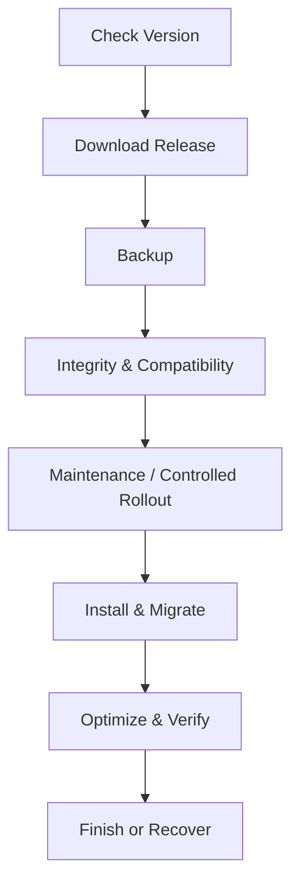

# oneQay Auto Updater Specification

## Secure Web Updater architecture foundation — 2026-08-17

ADR-009 is the authoritative architecture contract for the future Secure Web Updater and release control plane.

The selected model is **governed immutable release artifact + private active-release pointer**, not direct live overwrite and not runtime `git pull`/Composer/npm build. The initial trusted source is restricted to the canonical `labzefry/oneQay` release identity and approved immutable release assets. Arbitrary URL, arbitrary repository, arbitrary branch, and user-supplied artifact source are prohibited.

Updater execution must use a persisted operation state machine and global deployment lock so correctness does not depend on one browser request remaining connected. Releases are staged into isolated private directories, become immutable after staging/activation, and are activated only by an atomic/equivalently recoverable pointer update. A stable public bootstrap resolves the private active release. Post-switch `/health/ready` failure requires automatic application-pointer rollback to the previous stable release when compatible.

Updater v1 is explicitly **NO_SCHEMA_CHANGE**. A manifest declaring database/schema migration must fail closed until a separate migration-safe updater decision and authority exist. Database rollback must never be inferred from application release rollback.

Install-changing actions are platform-scoped privileged operations requiring authenticated superadmin capability, fresh privileged session, explicit re-authentication, verified TOTP/step-up, CSRF protection, rate limiting, and sanitized audit. Tenant context alone does not grant updater authority.

The updater feature flag defaults to **DISABLED**. This architecture publication does not authorize updater implementation, workflow YAML changes, artifact publication changes, cPanel mutation, deployment, database/schema/migration work, restore execution, M7.6, M7.7, Phase 0 Exit, Sprint 14, Release, or Production. Production readiness remains **NO-GO**.

Attribution: **Lab | zefry**

## Shared runtime environment corrective contract — 2026-08-17

A real M7.6 Preview rehearsal proved that a governed candidate with no embedded `.env` can fail before health verification if runtime secrets are not bound to the candidate. The sanitized failure class was `Illuminate\Encryption\MissingAppKeyException`; rollback restored the known-good baseline and both liveness and readiness returned healthy.

The corrective contract is **`PRIVATE_SHARED_DOTENV_V1`**:

- runtime secret state lives outside immutable releases under the stable private relative location `oneqay-preview/shared/runtime/.env`;
- governed release archives continue to reject `.env`, private keys, and secret-bearing payload files;
- the generated public bootstrap selects the shared environment before Laravel handles the request;
- the shared environment file is presence-inspected only for required `APP_KEY`; its value is never returned, persisted, or logged by updater controls;
- shared/runtime directories must be private and non-symlink; the environment file must be private, non-symlink, readable by the account, and bounded in size;
- cached `bootstrap/cache/config.php` is rejected from governed release input so shared environment loading cannot be bypassed by a stale cached configuration;
- missing or unsafe shared environment state fails closed before candidate activation;
- the same shared environment is reused across immutable candidate releases, while previous release directories remain unchanged for application rollback.

This corrective contract does not create a cPanel API adapter, does not expose or edit raw secrets through the updater UI, and does not authorize Production, schema migration, M7.7, Release, or runtime installer enablement.

## Purpose

Auto Updater memperbarui oneQay melalui release resmi dengan compatibility check, backup, integrity verification, maintenance/rollout control, migration, health verification, audit, dan recovery.

## Non-negotiable rules

- Hanya signed/trusted release source.
- Tidak ada update langsung dari arbitrary URL atau branch.
- Backup dan restore readiness diperiksa sebelum mutation.
- Compatibility matrix dan migration path wajib.
- Updater menggunakan lock global dan tenant-aware operational communication.
- Update tidak dinyatakan selesai sebelum health/business verification lulus.
- Runtime secrets tidak boleh tertanam pada immutable release artifact; candidate wajib membuktikan private shared-runtime binding sebelum activation.

## Workflow

## Release manifest

Manifest minimum: product, version, channel, release ID, commit, published at, minimum/current supported versions, runtime/database requirements, file checksums, package signature, migrations, estimated downtime, compatibility flags, release notes, rollback/recovery policy, dan key ID.

## Step specifications

### Check version

Gunakan configured trusted endpoint, TLS, timeout, retry, cache, channel policy, current version, compatibility, staged availability, dan admin authorization. Jangan bocorkan installation fingerprint yang tidak diperlukan.

### Download release

Download ke isolated temporary path, enforce size/type, support resumable download bila aman, verify transport, dan jangan mengeksekusi package sebelum signature/checksum valid.

### Backup

Backup database, configuration yang diperlukan, user uploads/state, current artifact/version metadata. Enkripsi dan verifikasi backup. Jika backup wajib gagal, update berhenti.

### Integrity verification

Verifikasi signature, checksum setiap file, product/release identity, signing key trust/revocation, compatibility, disk/memory/runtime, migration graph, dan tamper. Failure bersifat fail-closed.

### Maintenance mode

Aktifkan hanya bila diperlukan. Tampilkan safe status, pertahankan authorized bypass untuk recovery, hentikan/koordinasikan worker, drain request bila didukung, dan catat start/owner/reason.

### Install

Gunakan atomic extraction/swap; lindungi config, uploads, dan state. Tolak path traversal, symlink escape, unexpected executable, dan file yang tidak ada pada manifest. Simpan previous artifact untuk recovery. Shared runtime configuration tetap berada di private shared boundary dan tidak disalin ke immutable release payload.

### Migration

Jalankan migration terurut dengan lock, checkpoint, progress, timeout strategy, compatibility verification, dan invariant reconciliation. Destructive contract migration tidak digabung sebelum safe window selesai.

### Optimization

Rebuild cache/autoload/assets, restart/reload worker sesuai platform, dan clear stale tenant-aware cache tanpa menyebabkan cross-tenant mix.

### Finish

Jalankan technical dan business health checks, verifikasi version/schema/job/scheduler/audit, nonaktifkan maintenance, hapus temp secara aman, rekam update report, dan mulai observation window.

## Failure and recovery

| Failure point | Required response |
|---|---|
| Download/signature | Hapus/quarantine package, no mutation |
| Backup | Stop, preserve current system |
| Shared runtime binding | Stop before activation; preserve baseline |
| File install before migration | Atomic revert |
| Migration | Stop, preserve evidence, use rehearsed recovery/forward fix |
| Health verification | Re-enter maintenance or controlled rollback |
| Cleanup/report | System remains operational; create incident/task |

Database rollback tidak diasumsikan aman. Expand/contract dan forward recovery diprioritaskan.

## Channels and rollout

Channels dapat mencakup stable, preview, dan internal setelah disetujui. Tenant production default stable. Staged rollout menggunakan cohort yang dapat dihentikan berdasarkan error, latency, reconciliation, atau support signal.

## Security

Update permission privileged dan membutuhkan MFA/step-up. Signing key dipisahkan, dirotasi, memiliki revocation. Updater log diaudit dan direduksi. Remote code execution surface diminimalkan; script arbitrary dari manifest dilarang.

## Required tests

Supported upgrade paths, skipped versions, incompatible runtime/database, corrupt/tampered package, expired/revoked key, insufficient disk/permission, concurrent update, interrupted download/install/migration, backup failure, shared-runtime secret absence, shared-runtime symlink/permission failure, health failure, rollback/recovery, maintenance bypass, dan report redaction.

## Definition of Done

Release manifest valid, signature trusted, all supported paths diuji, backup/restore dan recovery direhearsal, shared runtime environment binding terbukti sebelum activation, monitoring/kill switch tersedia, documentation/changelog lengkap, dan update report auditable.
