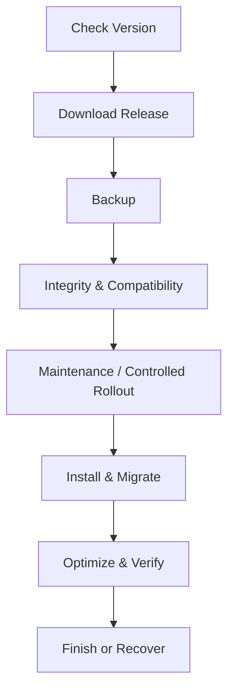

# OneQay Auto Updater Specification

## Purpose

Auto Updater memperbarui OneQay melalui release resmi dengan compatibility check, backup, integrity verification, maintenance/rollout control, migration, health verification, audit, dan recovery.

## Non-negotiable rules

- Hanya signed/trusted release source.
- Tidak ada update langsung dari arbitrary URL atau branch.
- Backup dan restore readiness diperiksa sebelum mutation.
- Compatibility matrix dan migration path wajib.
- Updater menggunakan lock global dan tenant-aware operational communication.
- Update tidak dinyatakan selesai sebelum health/business verification lulus.

## Workflow

## Release manifest

Manifest minimum: product, version, channel, release ID, commit, published at, minimum/current supported versions, runtime/database requirements, file checksums, package signature, migrations, estimated downtime, compatibility flags, release notes, rollback/recovery policy, dan key ID.

## Step specifications

### Check version

Gunakan configured trusted endpoint, TLS, timeout, retry, cache, channel policy, current version, compatibility, staged availability, dan admin authorization. Jangan bocorkan installation fingerprint yang tidak diperlukan.

### Download release

Download ke isolated temporary path, enforce size/type, support resumable download bila aman, verify transport, dan jangan mengeksekusi package sebelum signature/checksum valid.

### Backup

Backup database, configuration yang diperlukan, user uploads/state, current artifact/version metadata. Enkripsi dan verifikasi backup. Jika backup wajib gagal, update berhenti.

### Integrity verification

Verifikasi signature, checksum setiap file, product/release identity, signing key trust/revocation, compatibility, disk/memory/runtime, migration graph, dan tamper. Failure bersifat fail-closed.

### Maintenance mode

Aktifkan hanya bila diperlukan. Tampilkan safe status, pertahankan authorized bypass untuk recovery, hentikan/koordinasikan worker, drain request bila didukung, dan catat start/owner/reason.

### Install

Gunakan atomic extraction/swap; lindungi config, uploads, dan state. Tolak path traversal, symlink escape, unexpected executable, dan file yang tidak ada pada manifest. Simpan previous artifact untuk recovery.

### Migration

Jalankan migration terurut dengan lock, checkpoint, progress, timeout strategy, compatibility verification, dan invariant reconciliation. Destructive contract migration tidak digabung sebelum safe window selesai.

### Optimization

Rebuild cache/autoload/assets, restart/reload worker sesuai platform, dan clear stale tenant-aware cache tanpa menyebabkan cross-tenant mix.

### Finish

Jalankan technical dan business health checks, verifikasi version/schema/job/scheduler/audit, nonaktifkan maintenance, hapus temp secara aman, rekam update report, dan mulai observation window.

## Failure and recovery

| Failure point | Required response |
|---|---|
| Download/signature | Hapus/quarantine package, no mutation |
| Backup | Stop, preserve current system |
| File install before migration | Atomic revert |
| Migration | Stop, preserve evidence, use rehearsed recovery/forward fix |
| Health verification | Re-enter maintenance or controlled rollback |
| Cleanup/report | System remains operational; create incident/task |

Database rollback tidak diasumsikan aman. Expand/contract dan forward recovery diprioritaskan.

## Channels and rollout

Channels dapat mencakup stable, preview, dan internal setelah disetujui. Tenant production default stable. Staged rollout menggunakan cohort yang dapat dihentikan berdasarkan error, latency, reconciliation, atau support signal.

## Security

Update permission privileged dan membutuhkan MFA/step-up. Signing key dipisahkan, dirotasi, memiliki revocation. Updater log diaudit dan direduksi. Remote code execution surface diminimalkan; script arbitrary dari manifest dilarang.

## Required tests

Supported upgrade paths, skipped versions, incompatible runtime/database, corrupt/tampered package, expired/revoked key, insufficient disk/permission, concurrent update, interrupted download/install/migration, backup failure, health failure, rollback/recovery, maintenance bypass, dan report redaction.

## Definition of Done

Release manifest valid, signature trusted, all supported paths diuji, backup/restore dan recovery direhearsal, monitoring/kill switch tersedia, documentation/changelog lengkap, dan update report auditable.
