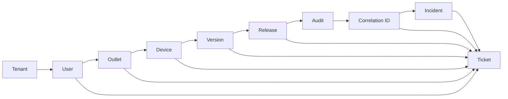
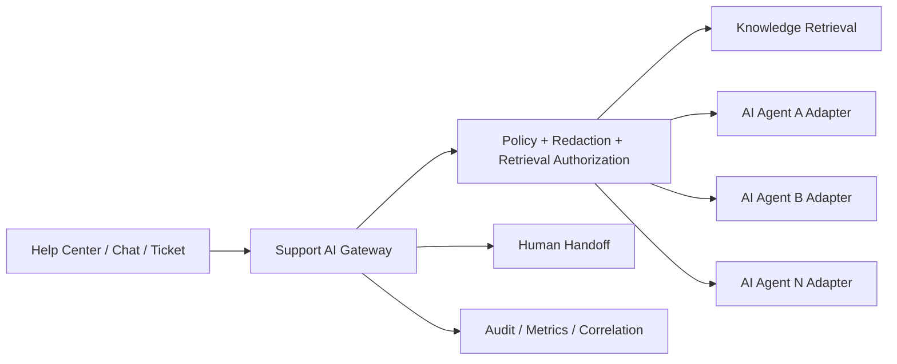

# oneQay Customer Service & Support Capability

## Status

- Product: **oneQay**
- Capability: **Customer Service & Support**
- Developer and Product Engineering Entity: **Lab | zefry**
- Repository: `labzefry/oneQay`
- Decision date: 2026-08-17
- Documentation base: `c05dbbaf98a8094dc3d8d8a69c544cfaf8e64301`
- Capability status: **APPROVED DIRECTIONAL PRODUCT CAPABILITY / DOCUMENTED**
- Source implementation authority: **NOT CREATED BY THIS DOCUMENT**
- Release authority: **NOT AUTHORIZED**
- Production authority: **NOT AUTHORIZED**
- Production readiness: **NO-GO**

This document records the Product Owner direction that oneQay must include a first-class **Customer Service & Support** capability. It supplements the existing Enterprise Vision, Architecture, Roadmap, and Platform Capability directions without silently authorizing source implementation, database mutation, deployment, Release, or Production.

Attribution: **Lab | zefry**

## Product intent

oneQay Customer Service & Support is intended to provide one governed support surface for tenants and their users from self-service assistance through AI-assisted support, live human interaction, ticket handling, incident response, SLA governance, customer satisfaction, and support analytics.

The capability must preserve end-to-end operational context so a support interaction can be correlated to the exact tenant, user, outlet, device, application version, release, audit evidence, request/error correlation ID, incident, and ticket where those dimensions are applicable.

Canonical support traceability direction:

`Tenant → User → Outlet → Device → Version → Release → Audit → Correlation ID → Incident → Ticket`

The traceability chain is contextual rather than a requirement that every support request must contain every node. A general knowledge question may have no Incident, while a technical failure must preserve all available technical and audit context. Missing optional context must never be fabricated.

## Capability map

The Customer Service & Support capability consists of the following governed sub-capabilities.

### Help Center

Customer-facing self-service surface for:

- searchable product help;
- getting-started guidance;
- troubleshooting guides;
- release/version-specific help;
- known-issue notices;
- tenant-authorized support entry points;
- escalation to AI Support, Live Chat, or Ticketing.

Help Center content must support localization, version applicability, publication lifecycle, access scope, and article audit history.

### Knowledge Base

Governed knowledge repository for:

- public articles;
- authenticated tenant articles;
- internal support-only articles;
- troubleshooting runbooks;
- incident workarounds;
- product/version/release compatibility information;
- reusable resolution knowledge from closed incidents and tickets.

Knowledge Base content requires versioning, ownership, review/publish state, visibility classification, searchable metadata, and immutable publication/audit history.

### AI Support

AI Support must use the existing oneQay AI architecture direction: provider abstraction, controlled policy boundary, tenant isolation, privacy controls, evaluation, observability, human accountability, and safe fallback.

The intended model supports multiple governed AI agents/providers through API credentials without hard-coding one provider into business logic.

Required direction:

- provider-neutral AI Gateway / Support AI Port;
- multiple AI agent profiles may be registered behind the gateway;
- agent profile records provider identifier, model/capability profile, policy profile, retrieval scope, version, status, priority/fallback position, and cost/latency controls;
- API keys and provider secrets must exist only in approved secret/configuration boundaries and must never be stored in plaintext application logs, browser storage, chat transcripts, ticket bodies, audit payloads, or analytics exports;
- tenant-owned provider credentials, if introduced later, require explicit tenant authorization, encryption, masked administration, rotation, revocation, and separate Product Owner implementation authority;
- platform-managed provider credentials remain platform secrets and must not be exposed to tenants or support operators;
- AI retrieval must be restricted to authorized Help Center / Knowledge Base / tenant support context;
- sensitive tenant or personal data must be minimized/redacted before provider transmission according to applicable data policy;
- AI must identify the source/version of governed knowledge used when the interface supports evidence display;
- AI must not invent incident, ticket, release, device, audit, or correlation records;
- low-confidence, policy-sensitive, billing/security/privacy, repeated-failure, or explicitly requested cases must support **Human Handoff**;
- provider timeout, quota, rate limit, unavailable model, unsafe response, or policy failure must degrade safely to another approved agent or human support path;
- all AI-assisted support decisions remain advisory unless an explicitly authorized deterministic workflow permits a bounded action.

AI Support must never have direct database access or unrestricted cross-tenant retrieval.

### Live Chat

Live Chat is the synchronous support channel connecting a tenant user with AI and/or human support agents.

Required direction:

- authenticated tenant/user context where available;
- queue/routing by product area, language, priority, tenant plan/entitlement, and agent capability where authorized;
- conversation identity independent from transport/provider;
- typing/presence/read-state may be channel features but are not authoritative business records;
- transcript retention follows data-retention/privacy policy;
- sensitive secrets must be redacted or blocked;
- chat can create or attach to a Ticket;
- chat can attach to an Incident when technical evidence warrants it;
- a conversation must retain correlation identifiers for relevant support operations.

### Ticketing

Ticketing is the durable case-management system for customer requests and support work.

Minimum directional ticket model:

- ticket ID;
- tenant ID;
- requester/user reference;
- optional outlet reference;
- optional device reference;
- optional application/version reference;
- optional release reference;
- correlation ID set;
- optional incident reference;
- category/type;
- severity/priority;
- status;
- assignment/team/agent reference;
- SLA policy and timers;
- conversation/comment timeline;
- attachments through secure file boundary;
- tags and product area;
- resolution code;
- closure reason;
- CSAT eligibility/result;
- audit history.

Ticket IDs must not be predictable security credentials. Authorization remains tenant-scoped and role/purpose-limited.

### SLA Management

SLA must be modeled as governed policy, not UI-only timers.

Directional SLA dimensions include:

- service tier / tenant entitlement;
- support channel;
- ticket priority/severity;
- business calendar/timezone;
- first-response target;
- next-response target where applicable;
- resolution target;
- pause/resume conditions;
- waiting-on-customer state;
- waiting-on-third-party state;
- escalation thresholds;
- breach warning;
- SLA breach event;
- exception/override with explicit authorization and audit.

Historical SLA calculations must remain reproducible from policy/version and event timestamps.

### Human Handoff

Human Handoff is a first-class transition, not a failure of AI Support.

Handoff must preserve:

- conversation/ticket identity;
- tenant/user context;
- sanitized AI conversation summary where policy permits;
- source knowledge references;
- attempted troubleshooting steps;
- correlation IDs;
- detected severity/risk flags;
- requested skill/team;
- reason for handoff;
- timestamps and audit evidence.

A human support agent must not inherit broader tenant access merely because a handoff occurred. Authorization remains purpose-limited and auditable.

### Incident Management

Incident Management represents a service/product failure or operational degradation that may affect one or more tickets, users, outlets, devices, versions, releases, or tenants.

Directional incident model:

- incident ID;
- severity;
- status and lifecycle;
- detected/declared/resolved timestamps;
- affected capability/service;
- affected version/release range;
- affected tenant/outlet/device scope where known and authorized;
- correlation IDs and observability references;
- linked tickets;
- owner/incident commander;
- customer-facing status/update classification;
- internal timeline;
- mitigation/workaround;
- root-cause reference when available;
- corrective/preventive action references;
- post-incident review reference;
- audit history.

One Incident may link to many Tickets. A Ticket may exist without an Incident. Cross-tenant incident aggregation must expose only authorized aggregate/platform information and must not leak one tenant's records to another.

### Customer Satisfaction

Customer Satisfaction (CSAT) must provide bounded feedback after eligible support interactions.

Directional capabilities:

- configurable survey trigger;
- rating scale;
- optional structured reason;
- optional free-text feedback subject to privacy controls;
- association with ticket/conversation/agent/channel;
- anti-abuse and duplicate-response controls;
- tenant-scoped reporting;
- support quality trend analysis;
- explicit distinction between support-agent performance and product/service incident impact.

CSAT must not be used as the sole automated basis for punitive personnel decisions.

### Support Analytics

Support Analytics provides operational and management visibility without bypassing tenant/data boundaries.

Directional metrics include:

- support volume;
- ticket inflow/backlog;
- first-response time;
- resolution time;
- SLA compliance/breach rate;
- reopen rate;
- transfer/handoff rate;
- AI containment rate;
- AI-to-human escalation rate;
- first-contact resolution;
- incident-linked ticket volume;
- ticket volume by tenant/outlet/device/version/release;
- recurring issue/product-area trends;
- CSAT and satisfaction drivers;
- support-agent/team workload;
- knowledge deflection and article usefulness;
- AI provider/agent latency, availability, cost, fallback, and policy-block metrics.

Analytics output must apply access control, tenant isolation, privacy, aggregation thresholds where needed, and safe handling of low-volume or sensitive dimensions.

## Canonical support traceability model

Interpretation:

- **Tenant** is the mandatory isolation boundary for tenant-owned support data.
- **User** identifies the requester/actor where authenticated identity exists.
- **Outlet** provides business-location context without replacing tenant authorization.
- **Device** provides managed endpoint/POS/device context where applicable.
- **Version** identifies application/client/server component version relevant to the case.
- **Release** identifies the governed release/deployment artifact associated with the observed behavior.
- **Audit** records security/business/administrative evidence; support must link rather than copy sensitive audit payload unnecessarily.
- **Correlation ID** connects request/error/job/integration traces across observability and support evidence.
- **Incident** represents a product/service disruption and may aggregate many correlated cases.
- **Ticket** is the durable customer-support case and preserves references to available upstream context.

The model must support many-to-one and one-to-many relationships where operational reality requires them. The arrow chain is a traceability direction, not a database foreign-key prescription.

## Correlation and diagnostic capture

When a support case originates from an application error or device issue, oneQay should be able to pre-populate safe diagnostics such as:

- tenant reference;
- authenticated user reference;
- outlet/device reference;
- application version;
- governed release identifier;
- correlation/error reference;
- timestamp;
- feature/product area;
- sanitized client/runtime metadata;
- relevant health/status classification.

Diagnostic capture must never automatically include passwords, API keys, access tokens, payment secrets, raw sensitive personal data, unrestricted request bodies, database credentials, or cross-tenant information.

A visible user action such as **Report a problem** may later create a support draft containing only safe metadata before the user reviews and submits it.

## Audit requirements

Auditable support events should include, where applicable:

- ticket created/updated/assigned/escalated/closed/reopened;
- SLA policy attached/changed/paused/resumed/breached;
- incident declared/severity changed/mitigated/resolved;
- ticket-incident link/unlink;
- human handoff initiated/accepted/completed;
- privileged support access;
- support impersonation/break-glass use if separately authorized under identity policy;
- KB article draft/review/publish/archive;
- AI provider/agent selection and fallback metadata without secret leakage;
- AI policy block / human escalation;
- attachment access/deletion;
- CSAT submitted;
- sensitive support-data export.

Audit must record actor, tenant/purpose context, correlation ID, stable event type, timestamp, and bounded safe metadata.

## Security, privacy, and tenancy boundary

Customer Service & Support must inherit the oneQay deny-by-default security model.

Required principles:

- tenant support data is tenant-isolated by default;
- platform support access requires an explicit support role/purpose and must be audited;
- support impersonation/break-glass, if enabled, remains separated from ordinary support access and requires step-up controls defined by identity governance;
- no support role receives unrestricted direct database access;
- attachments use the governed file/document security boundary;
- message/ticket search is tenant-aware and permission-aware;
- sensitive fields support masking/redaction where required by data policy;
- retention/deletion follows approved data-retention and legal-hold rules;
- API credentials and secrets are never copied into ticket/chat/incident text by the system;
- cross-tenant analytics are platform-governed aggregate views only;
- all external support/AI/chat providers use controlled adapters with timeout, retry, circuit-breaker/fallback, rate-limit, audit, and failure mapping where applicable.

## Integration with existing oneQay architecture

This capability depends on and must reuse existing/future governed platform contracts rather than creating parallel identity or telemetry systems.

Required integrations:

- Tenant & Organization;
- Identity & Access;
- Organization / Outlet / Device context;
- Notification;
- Audit;
- Search;
- File / Document;
- API / Integration;
- Observability;
- Configuration / Secret Management;
- Release / Version / Updater control plane;
- Correlation ID / error-reference foundation;
- AI Gateway / Policy Boundary;
- Reporting & Business Intelligence.

Customer Service & Support should be designed as a bounded platform/business-management capability with explicit application contracts. It must not read another module's tables directly.

## Directional domain boundaries

The following boundaries are candidates for later domain design, not final physical modules:

- Support Knowledge;
- Support Conversation;
- Support Ticket;
- Support SLA;
- Support Incident;
- Support Satisfaction;
- Support Analytics;
- Support AI Orchestration.

A future implementation may combine these inside a modular monolith while retaining explicit contracts and owned persistence boundaries.

## Ticket and incident lifecycle direction

### Ticket lifecycle

Recommended directional states:

`NEW → TRIAGED → OPEN → PENDING_CUSTOMER / PENDING_INTERNAL / PENDING_THIRD_PARTY → RESOLVED → CLOSED`

Additional controlled transition:

`RESOLVED / CLOSED → REOPENED → OPEN`

Exact state names and transition authority require a later domain decision. SLA clocks must derive from events and policy rather than ad-hoc UI state.

### Incident lifecycle

Recommended directional states:

`DETECTED → DECLARED → INVESTIGATING → IDENTIFIED → MONITORING → RESOLVED → POST_INCIDENT_REVIEWED`

Exact incident severity taxonomy and operational command model require later authorization.

## AI agent and provider governance

The support capability must be compatible with multiple AI agents without exposing provider-specific logic to Ticketing, Incident, or Knowledge domain rules.

Directional architecture:

Provider/agent selection may consider:

- capability;
- language;
- tenant policy;
- data classification;
- availability;
- latency;
- cost budget;
- model quality/evaluation score;
- region/jurisdiction policy;
- fallback priority.

Provider selection must not weaken security or tenant isolation to reduce cost or latency.

## Development sequencing

The capability may be documented now, but implementation must follow its technical dependencies.

### SCS-0 — Support Domain & Traceability Foundation

Earliest sensible implementation point: after durable application persistence, governed migration execution, stable identity/tenant/outlet/device persistence, and release/version identifiers exist.

Scope candidate:

- canonical support identifiers/contracts;
- tenant/user/outlet/device/version/release references;
- correlation-to-support contract;
- Ticket and Incident domain foundations;
- audit event vocabulary;
- no public support UI required yet.

This is the best candidate for an **early foundation implementation** if the Product Owner wants Customer Service & Support pulled forward.

### SCS-1 — Help Center + Knowledge Base + Core Ticketing

Recommended placement: **late Phase 1 / early Phase 2**, after the platform foundation is durably persisted and safe migration/release/audit contracts exist.

Scope candidate:

- Help Center;
- Knowledge Base;
- authenticated support request;
- Ticket lifecycle;
- safe diagnostic/correlation attachment;
- basic incident linkage;
- notification integration.

### SCS-2 — Live Chat + SLA + Human Handoff + Incident Operations + CSAT

Recommended default placement: **Phase 4 — SaaS Commercial Platform**, where the existing roadmap already includes customer portal plus support and operational controls.

This stage can be pulled earlier only through a separate Product Owner prioritization decision after SCS-0/SCS-1 dependencies are satisfied.

### SCS-3 — AI Support Multi-Agent

Recommended default placement: **Phase 6 — Intelligent Operations**, after AI Gateway/provider abstraction, tenant-authorized retrieval, privacy/redaction, evaluation, cost/latency budget, prompt/model versioning, and safe fallback are available.

A bounded earlier AI support pilot may be considered only after those same AI safety/provider controls are separately implemented; using a raw API key directly from chat/ticket code is explicitly not an acceptable shortcut.

### SCS-4 — Advanced Support Analytics

Operational support metrics may begin with SCS-1/SCS-2. Cross-channel, incident intelligence, knowledge effectiveness, AI containment/provider analytics, prediction, and recommendation belong primarily with **Phase 4 / Phase 6** capabilities depending on their use of AI and enterprise analytics.

## Recommended priority relative to current project state

At the publication baseline for this document, Sprint 14 Migration Planning Artifact Foundation is already published while durable application persistence, migration execution, final business schema, Release, and Production remain separately gated.

Therefore:

1. **Documentation and domain design can begin now.**
2. **Do not build the full support product immediately before persistence/release/version foundations are durable.**
3. After the immediate post-Sprint-14 persistence/migration foundations are governed, **SCS-0 can become a near-term candidate**.
4. Help Center/Knowledge Base/Core Ticketing can then be developed in late Phase 1 / early Phase 2 if Product Owner priority justifies pulling it forward.
5. Full Live Chat/SLA/Handoff/Incident Operations/CSAT remains naturally aligned with Phase 4 unless explicitly accelerated.
6. AI Support using multiple governed agents/providers should normally wait for the Phase 6 AI Gateway/policy foundation or an equivalent separately authorized earlier AI foundation.

The project roadmap intentionally does not assign calendar dates before capacity, dependencies, and risk buffers are approved. This document therefore records dependency-based timing rather than promising a release date.

## Minimum entry criteria before SCS-0 source implementation

Before Customer Service & Support source implementation begins, fresh evidence should confirm at minimum:

- durable tenant/user/outlet/device identities and authorization boundaries;
- persistence and migration execution foundation published;
- stable correlation/error reference contract;
- audit contract and retention rules;
- version/release identity contract;
- configuration/secret handling for external providers;
- file/document security boundary for attachments if included in the first slice;
- Product Owner-approved bounded SCS implementation scope;
- exact-head CI/security gates defined for that slice.

AI Support additionally requires:

- AI Gateway/provider abstraction;
- provider secret isolation and rotation;
- tenant-authorized retrieval;
- privacy/redaction rules;
- evaluation and safe-fallback criteria;
- human-handoff contract;
- provider/model/version observability;
- cost and rate-limit controls.

## Explicit non-authority

This documentation does **not** authorize or perform:

- Customer Service & Support source implementation;
- schema/SQL/migration execution;
- database creation or mutation;
- external AI provider account creation or API-key storage;
- Live Chat provider installation;
- deployment;
- GitHub Release;
- Production/customer data processing;
- Production support operation;
- Production readiness promotion.

Each implementation slice remains separately bounded and must start from fresh canonical repository state.

Attribution: **Lab | zefry**
